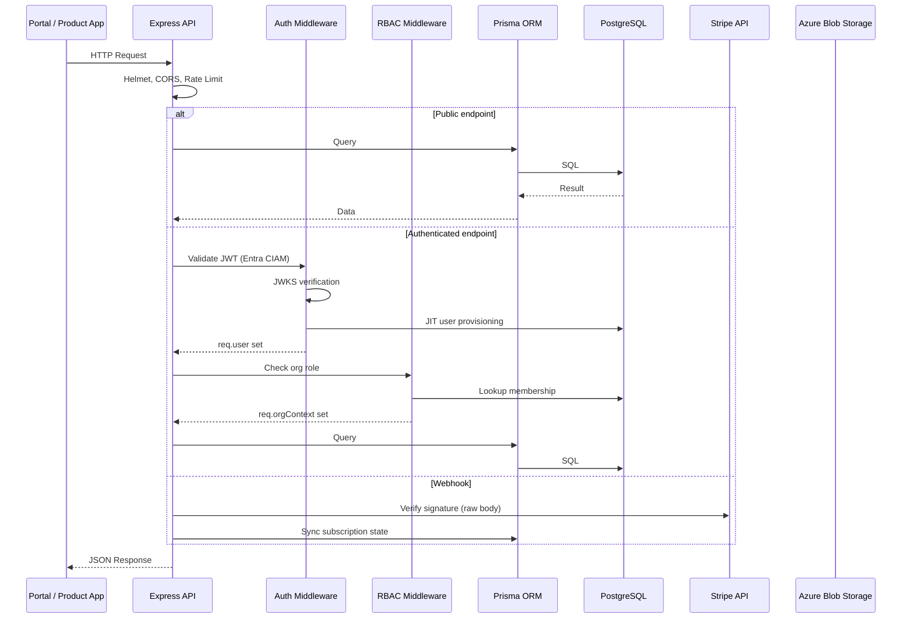
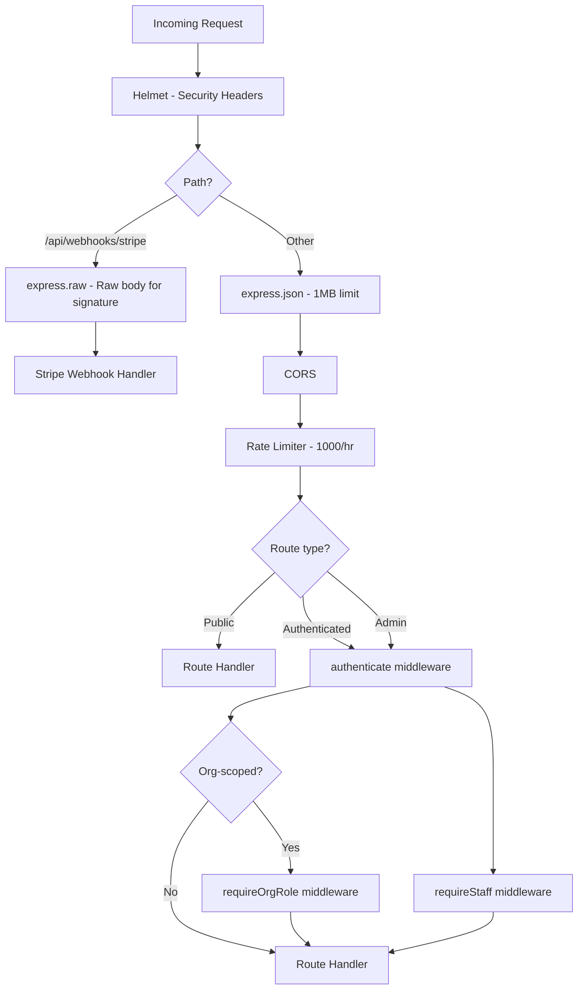
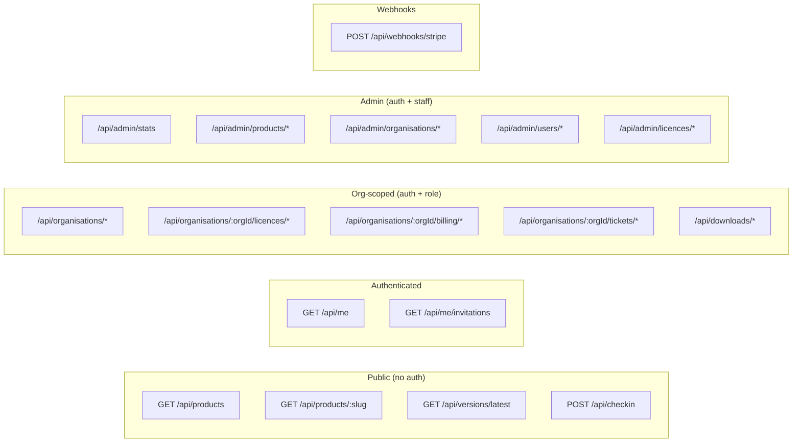
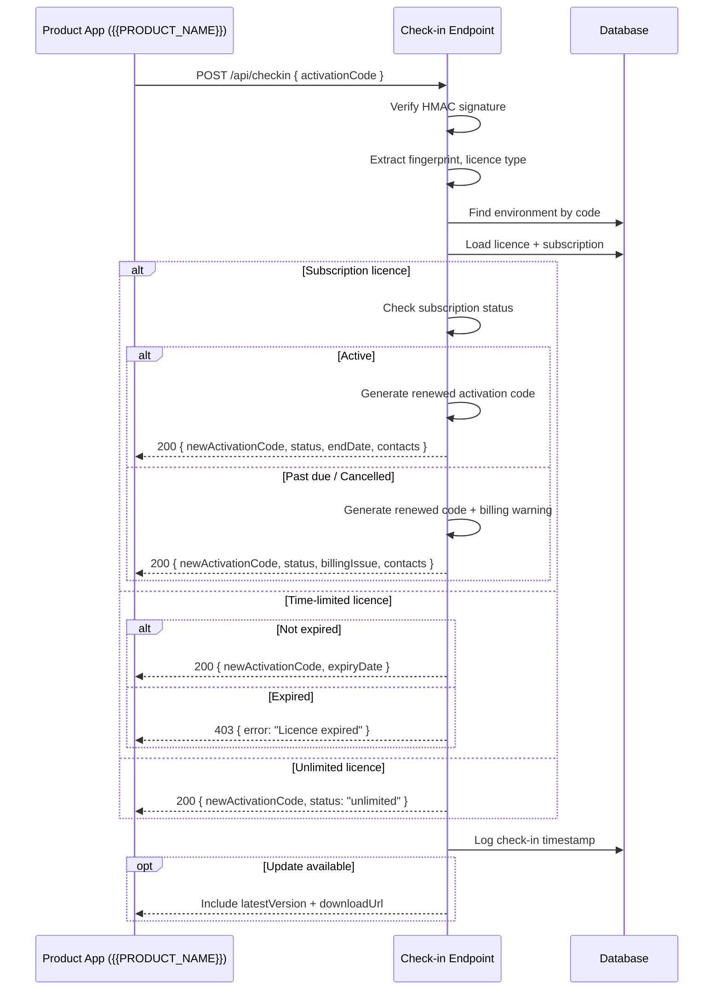
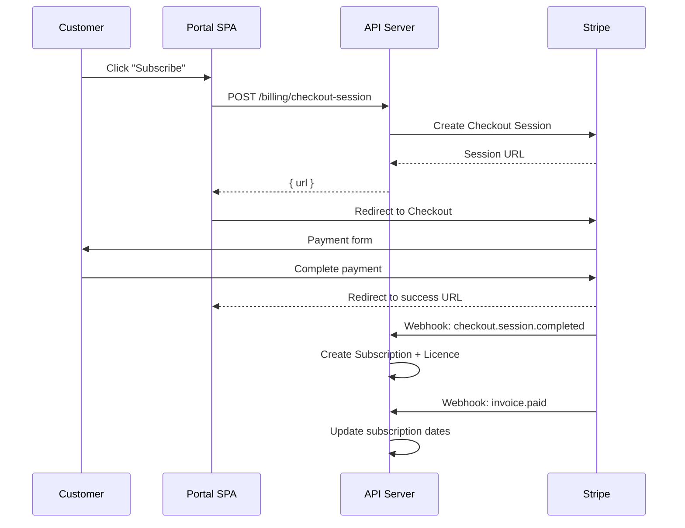
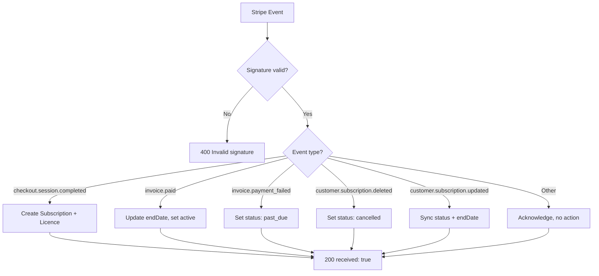

# API

## Overview

The API (`packages/api`) is an Express + TypeScript server with Prisma ORM. It serves the portal frontend, handles Stripe webhooks, provides public machine-to-machine endpoints for product apps, and exposes an admin interface for staff.

**Base URL**: `https://api.{{DOMAIN}}`

## Request Flow



## Middleware Stack



### Security Middleware

| Middleware | Purpose |
|-----------|---------|
| `helmet()` | Sets security headers (CSP, HSTS, X-Frame-Options, etc.) |
| `cors()` | Restricts cross-origin requests to `portal.{{DOMAIN}}` |
| `express-rate-limit` | 1000 requests/hour (general), 10 requests/hour (check-in) |
| `express.json({ limit: '1mb' })` | JSON body parsing with size limit |
| `express.raw()` | Raw body for Stripe webhook signature verification |

### Authentication Middleware (`authenticate`)

1. Extract Bearer token from `Authorization` header
2. Decode JWT header, fetch signing key from JWKS (cached 10min)
3. Verify token against Entra External ID issuer and audience
4. Extract claims: `sub`/`oid` (identity), `emails[0]`/`email`/`preferred_username` (email)
5. JIT provisioning: find user by `entraObjectId`, or upsert by email
6. Attach `req.user` with `id`, `email`, `name`, `entraObjectId`, `isStaff`

### RBAC Middleware (`requireOrgRole`)

1. Read `:orgId` from route parameters
2. Look up `OrgMembership` for `req.user.id` + `orgId`
3. Verify role is in the allowed list
4. Attach `req.orgContext` with `orgId` and `role`

## Route Map



## Public Endpoints

No authentication required.

### Products

| Method | Path | Description |
|--------|------|-------------|
| `GET` | `/api/products` | List all active products with pricing plans |
| `GET` | `/api/products/:slug` | Get single product by slug |

### Versions

| Method | Path | Description |
|--------|------|-------------|
| `GET` | `/api/versions/latest` | Latest {{PRODUCT_NAME}} version info (version, releaseDate, releaseNotes, downloadUrl) |

### Check-in (Machine-to-Machine)

| Method | Path | Description |
|--------|------|-------------|
| `POST` | `/api/checkin` | Product app daily check-in (rate limited: 10/hr per IP) |

**Request body**: `{ activationCode, productId?, currentVersion? }`

**Check-in flow**:



**Response includes**:
- Renewed activation code (fresh dates)
- Licence status and type
- Technical and billing contact emails (from org membership roles)
- Update availability (compares `currentVersion` with latest)

## Authenticated Endpoints

Require Bearer token from Entra External ID.

### User Profile

| Method | Path | Description |
|--------|------|-------------|
| `GET` | `/api/me` | Current user profile |
| `GET` | `/api/me/invitations` | Pending org invitations for the user |

### Organisations

All routes scoped to the authenticated user's memberships.

| Method | Path | Required Role | Description |
|--------|------|---------------|-------------|
| `GET` | `/api/organisations` | Any member | List user's organisations |
| `POST` | `/api/organisations` | Any user | Create new organisation (creator = owner) |
| `GET` | `/api/organisations/:orgId` | Any member | Get org details with stats |
| `PATCH` | `/api/organisations/:orgId` | `owner` | Update org name |
| `DELETE` | `/api/organisations/:orgId` | `owner` | Delete org (no active subscriptions) |
| `GET` | `/api/organisations/:orgId/members` | Any member | List org members |
| `GET` | `/api/organisations/:orgId/invitations` | `owner`, `admin` | List pending invitations |
| `POST` | `/api/organisations/:orgId/invitations` | `owner`, `admin` | Invite member (7-day expiry) |
| `POST` | `/api/organisations/:orgId/invitations/:token/accept` | Any user | Accept invitation |
| `DELETE` | `/api/organisations/:orgId/invitations/:invitationId` | `owner`, `admin` | Cancel invitation |
| `PATCH` | `/api/organisations/:orgId/members/:userId/role` | `owner` | Change member role (ownership transfer supported) |
| `DELETE` | `/api/organisations/:orgId/members/:userId` | `owner`, `admin` | Remove member |

### Licences

| Method | Path | Required Role | Description |
|--------|------|---------------|-------------|
| `GET` | `/:orgId/licences` | All roles | List org licences with subscription status |
| `GET` | `/:orgId/licences/:licenceId/environments` | `owner`, `admin`, `technical` | List licence environments |
| `POST` | `/:orgId/licences/:licenceId/environments` | `owner`, `admin`, `technical` | Register new environment |
| `POST` | `/:orgId/licences/:licenceId/environments/:envId/activate` | `owner`, `admin`, `technical` | Generate activation code |
| `PATCH` | `/:orgId/licences/:licenceId/environments/:envId` | `owner`, `admin`, `technical` | Update environment name |
| `DELETE` | `/:orgId/licences/:licenceId/environments/:envId` | `owner`, `admin`, `technical` | Delete environment |

### Billing

| Method | Path | Required Role | Description |
|--------|------|---------------|-------------|
| `POST` | `/:orgId/billing/checkout-session` | `owner`, `admin`, `billing` | Create Stripe Checkout session |
| `POST` | `/:orgId/billing/portal-session` | `owner`, `admin`, `billing` | Create Stripe Customer Portal session |

### Billing Flow



### Support Tickets

| Method | Path | Required Role | Description |
|--------|------|---------------|-------------|
| `GET` | `/:orgId/tickets` | Any member | List org tickets (paginated, 20/page) |
| `POST` | `/:orgId/tickets` | Any member | Create ticket with initial message |
| `GET` | `/tickets/:ticketId` | Member or staff | Get ticket detail + messages |
| `POST` | `/tickets/:ticketId/messages` | Member or staff | Add message (staff: internal notes supported) |

### Downloads

| Method | Path | Required Role | Description |
|--------|------|---------------|-------------|
| `GET` | `/api/downloads` | Any authenticated | List available downloads (filter by category) |
| `GET` | `/api/downloads/:fileId/url` | Any authenticated | Generate 15-minute SAS URL |

## Webhooks

### Stripe (`POST /api/webhooks/stripe`)

Raw body endpoint — `express.raw()` must execute before `express.json()`.



**Idempotency**: All handlers check for existing records before creating. Duplicate webhook deliveries are safe.

## Admin Endpoints

All admin routes require `authenticate` + `requireStaff`.

### Dashboard

| Method | Path | Description |
|--------|------|-------------|
| `GET` | `/api/admin/stats` | System-wide statistics |
| `GET` | `/api/admin/products/:productId/dashboard` | Per-product dashboard (subs, licences, envs, tickets, downloads) |

### Product Management

| Method | Path | Description |
|--------|------|-------------|
| `GET` | `/api/admin/products` | List all products (including inactive) |
| `POST` | `/api/admin/products` | Create product (auto-generates slug) |
| `PATCH` | `/api/admin/products/:productId` | Update product details |
| `POST` | `/api/admin/products/:productId/pricing-plans` | Add pricing plan |
| `PATCH` | `/api/admin/products/:productId/pricing-plans/:planId` | Update pricing plan |
| `DELETE` | `/api/admin/products/:productId/pricing-plans/:planId` | Delete pricing plan |

### Organisation Management

| Method | Path | Description |
|--------|------|-------------|
| `GET` | `/api/admin/organisations` | Search orgs (paginated, searchable) |
| `GET` | `/api/admin/organisations/:orgId` | Full org detail (members, subs, licences, envs) |
| `POST` | `/api/admin/organisations` | Create org (optionally assign owner) |
| `PATCH` | `/api/admin/organisations/:orgId` | Update org name |
| `DELETE` | `/api/admin/organisations/:orgId` | Delete org (no active subs required) |
| `POST` | `/api/admin/organisations/:orgId/invitations` | Invite user (30-day expiry) |
| `POST` | `/api/admin/organisations/:orgId/members` | Directly add member (no invite) |
| `PATCH` | `/api/admin/organisations/:orgId/members/:userId/role` | Change member role |
| `DELETE` | `/api/admin/organisations/:orgId/members/:userId` | Remove member |

### User Management

| Method | Path | Description |
|--------|------|-------------|
| `GET` | `/api/admin/users` | Search users (paginated, by name/email) |
| `PATCH` | `/api/admin/users/:userId/staff` | Toggle staff flag |
| `DELETE` | `/api/admin/users/:userId` | Delete user (blocked if org owner) |

### Licence Management

| Method | Path | Description |
|--------|------|-------------|
| `POST` | `/api/admin/organisations/:orgId/licences` | Assign licence (time_limited or unlimited) |
| `PATCH` | `/api/admin/licences/:licenceId/max-environments` | Update max environments |
| `POST` | `/api/admin/organisations/:orgId/licences/:licenceId/environments/:envId/activate` | Staff activation code (any licence type) |
| `POST` | `/api/admin/activate` | Raw activation code generator (no audit trail) |

## Error Responses

All errors return JSON:

```json
{ "error": "Description of the error" }
```

| Status | Meaning |
|--------|---------|
| `400` | Bad request (validation error, missing fields) |
| `401` | Authentication required or token invalid/expired |
| `403` | Forbidden (insufficient role, not a member, not staff) |
| `404` | Resource not found |
| `429` | Rate limit exceeded |
| `500` | Internal server error |

## Configuration

Environment variables loaded via `packages/api/src/lib/config.ts`:

| Variable | Required | Default | Description |
|----------|----------|---------|-------------|
| `DATABASE_URL` | Yes | — | PostgreSQL connection string |
| `ENTRA_EXTERNAL_ID_TENANT` | Yes | — | CIAM tenant subdomain |
| `ENTRA_EXTERNAL_ID_TENANT_ID` | Yes | — | CIAM tenant GUID |
| `ENTRA_EXTERNAL_ID_CLIENT_ID` | Yes | — | CIAM app client ID |
| `STRIPE_SECRET_KEY` | Yes | — | Stripe secret key |
| `STRIPE_WEBHOOK_SECRET` | Yes | — | Stripe webhook signing secret |
| `ACTIVATION_HMAC_KEY` | Yes | — | HMAC key for activation codes |
| `PORT` | No | `3001` | Server port |
| `NODE_ENV` | No | `development` | Environment |
| `PORTAL_URL` | No | `http://localhost:5173` | Portal URL (CORS, redirects) |
| `AZURE_STORAGE_CONNECTION_STRING` | No | — | Azure Blob Storage connection |
| `AZURE_STORAGE_CONTAINER_NAME` | No | `downloads` | Blob container name |
