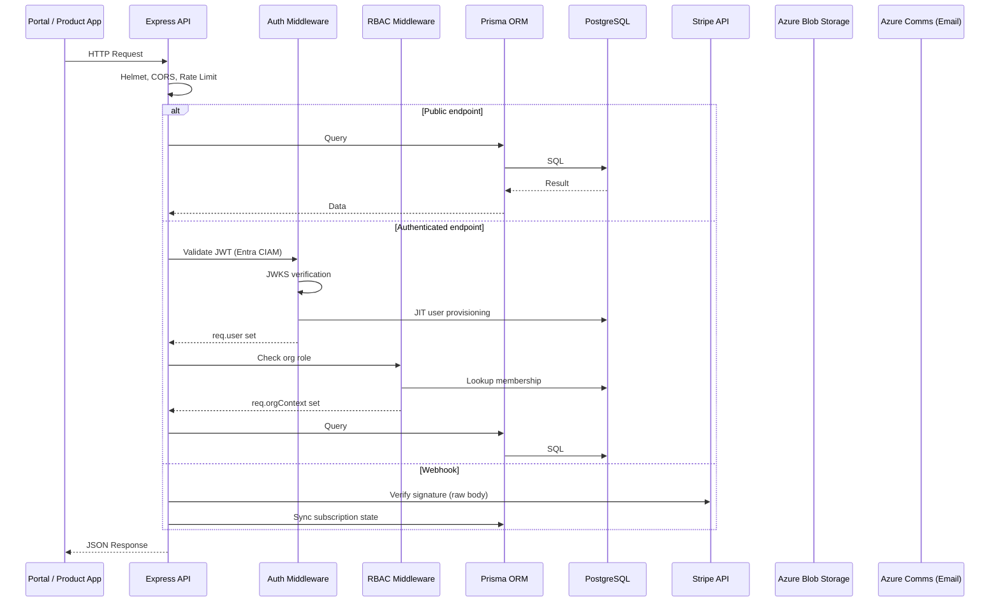

# API

## Overview

The API (`packages/api`) is an Express + TypeScript server with Prisma ORM. It serves the portal frontend, handles Stripe webhooks, provides public machine-to-machine endpoints for product apps, and exposes an admin interface for staff. It also runs background services for email notifications, SLA monitoring, and version notifications.

**Base URL**: `https://api.{{DOMAIN}}`

## Request Flow



## Middleware Stack

### Security Middleware

| Middleware                       | Purpose                                                                               |
| -------------------------------- | ------------------------------------------------------------------------------------- |
| `helmet()`                       | Sets security headers (CSP, HSTS, X-Frame-Options, etc.)                              |
| `cors()`                         | Portal: `portal.{{DOMAIN}}`; Public: Power Apps/Dynamics domains + localhost (dev) |
| `express-rate-limit`             | General: 1000/hr per IP; Check-in: 10/hr per IP                                       |
| `express.json({ limit: '1mb' })` | JSON body parsing with size limit                                                     |
| `express.raw()`                  | Raw body for Stripe webhook signature verification                                    |
| `multer`                         | File uploads (tickets, admin uploads)                                                 |

### Authentication Middleware (`authenticate`)

1. Extract Bearer token from `Authorization` header
2. Decode JWT header, fetch signing key from JWKS (cached 10min)
3. Verify token against Entra External ID issuer and audience
4. Extract claims: `sub`/`oid` (identity), `emails[0]`/`email`/`preferred_username` (email)
5. JIT provisioning: find user by `entraObjectId`, or upsert by email
6. Attach `req.user` with `id`, `email`, `name`, `jobTitle`, `phone`, `mobile`, `entraObjectId`, `isStaff`, `marketingOptOut`

### RBAC Middleware (`requireOrgRole`)

1. Read `:orgId` from route parameters
2. Look up `OrgMembership` for `req.user.id` + `orgId`
3. Verify role is in the allowed list
4. Attach `req.orgContext` with `orgId` and `role`

## Route Map

### Middleware Order in `index.ts` (Critical)

```
1. trust proxy (behind load balancer)
2. helmet (security headers)
3. Public CORS (Power Apps + Dynamics + localhost dev)
4. Portal CORS (portal.{{DOMAIN}} only)
5. Stripe webhook route with express.raw() — BEFORE json parser
6. express.json({ limit: '1mb' }) — AFTER webhook routes
7. Rate limiting (general: 1000/hr, check-in: 10/hr)
8. Public routes: products, versions, check-in, contact, kb, customer-logos, testimonials
9. Health check: GET /health
10. authenticate middleware
11. Authenticated routes: me, organisations, licences, billing, tickets, downloads, feedback, upload
12. Admin routes: requireStaff
```

## Public Endpoints

No authentication required.

### Products

| Method | Path                  | Description                                 |
| ------ | --------------------- | ------------------------------------------- |
| `GET`  | `/api/products`       | List all active products with pricing plans |
| `GET`  | `/api/products/:slug` | Get single product by slug                  |

### Versions

| Method | Path                         | Description                                            |
| ------ | ---------------------------- | ------------------------------------------------------ |
| `GET`  | `/api/versions/latest`       | Latest version per product (or filter by `?productId`) |
| `GET`  | `/api/versions/:productSlug` | All versions for a specific product                    |

### Check-in (Machine-to-Machine)

| Method | Path           | Description                                             |
| ------ | -------------- | ------------------------------------------------------- |
| `POST` | `/api/checkin` | Product app daily check-in (rate limited: 10/hr per IP) |

**Request body**: `{ activationCode, productId?, currentVersion? }`

**Response includes**:

- Renewed activation code (fresh dates)
- Licence status and type
- Technical and billing contact emails (from org membership roles)
- Update availability (compares `currentVersion` with latest)

### Contact Form

| Method | Path           | Description                                     |
| ------ | -------------- | ----------------------------------------------- |
| `POST` | `/api/contact` | Submit contact form (stored + emailed to sales) |

### Knowledge Base (Public)

| Method | Path                   | Description                                             |
| ------ | ---------------------- | ------------------------------------------------------- |
| `GET`  | `/api/kb`              | List published articles (filter: `?productId`, `?type`) |
| `GET`  | `/api/kb/search?q=...` | Search articles by title/body (min 2 chars)             |
| `GET`  | `/api/kb/:slug`        | Get article by slug                                     |

### Customer Logos

| Method | Path                  | Description                                         |
| ------ | --------------------- | --------------------------------------------------- |
| `GET`  | `/api/customer-logos` | Get active logos for landing/product page carousels |

### Testimonials (Public)

| Method | Path                | Description                                         |
| ------ | ------------------- | --------------------------------------------------- |
| `GET`  | `/api/testimonials` | Get approved testimonials for landing/product pages |

## Authenticated Endpoints

Require Bearer token from Entra External ID.

### User Profile

| Method  | Path                  | Description                                                     |
| ------- | --------------------- | --------------------------------------------------------------- |
| `GET`   | `/api/me`             | Current user profile                                            |
| `PATCH` | `/api/me`             | Update profile (name, jobTitle, phone, mobile, marketingOptOut) |
| `GET`   | `/api/me/invitations` | Pending org invitations for the user                            |

### Organisations

| Method   | Path                                                  | Required Role    | Description                                       |
| -------- | ----------------------------------------------------- | ---------------- | ------------------------------------------------- |
| `GET`    | `/api/organisations`                                  | Any member       | List user's organisations                         |
| `POST`   | `/api/organisations`                                  | Any user         | Create new organisation (creator = owner)         |
| `GET`    | `/api/organisations/:orgId`                           | Any member       | Get org details with stats                        |
| `PATCH`  | `/api/organisations/:orgId`                           | `owner`, `admin` | Update org name                                   |
| `DELETE` | `/api/organisations/:orgId`                           | `owner`, `admin` | Delete org (no active subscriptions)              |
| `GET`    | `/api/organisations/:orgId/members`                   | Any member       | List org members                                  |
| `GET`    | `/api/organisations/:orgId/invitations`               | `owner`, `admin` | List pending invitations                          |
| `POST`   | `/api/organisations/:orgId/invitations`               | `owner`, `admin` | Invite member (7-day expiry, email sent)          |
| `POST`   | `/api/organisations/invitations/:token/accept`        | Any user         | Accept invitation                                 |
| `DELETE` | `/api/organisations/:orgId/invitations/:invitationId` | `owner`, `admin` | Cancel invitation                                 |
| `PATCH`  | `/api/organisations/:orgId/members/:userId/role`      | `owner`, `admin` | Change member role (admins cannot change owner role or transfer ownership) |
| `DELETE` | `/api/organisations/:orgId/members/:userId`           | `owner`, `admin` | Remove member                                     |

### Licences

| Method   | Path                                                       | Required Role                 | Description                                                     |
| -------- | ---------------------------------------------------------- | ----------------------------- | --------------------------------------------------------------- |
| `GET`    | `/:orgId/licences`                                         | All roles                     | List org licences with subscription status                      |
| `GET`    | `/:orgId/licences/:licenceId/environments`                 | `owner`, `admin`, `technical` | List licence environments                                       |
| `POST`   | `/:orgId/licences/:licenceId/environments`                 | `owner`, `admin`, `technical` | Register new environment (validates XXXX-XXXX-XXXX-XXXX format) |
| `POST`   | `/:orgId/licences/:licenceId/environments/:envId/activate` | `owner`, `admin`, `technical` | Generate activation code (portal: subscription only)            |
| `PATCH`  | `/:orgId/licences/:licenceId/environments/:envId`          | `owner`, `admin`, `technical` | Update environment name                                         |
| `DELETE` | `/:orgId/licences/:licenceId/environments/:envId`          | `owner`, `admin`, `technical` | Delete environment                                              |

### Billing

| Method | Path                               | Required Role               | Description                           |
| ------ | ---------------------------------- | --------------------------- | ------------------------------------- |
| `POST` | `/:orgId/billing/checkout-session` | `owner`, `admin`, `billing` | Create Stripe Checkout session        |
| `POST` | `/:orgId/billing/portal-session`   | `owner`, `admin`, `billing` | Create Stripe Customer Portal session |

### Support Tickets

| Method | Path                                    | Required Role   | Description                                                          |
| ------ | --------------------------------------- | --------------- | -------------------------------------------------------------------- |
| `GET`  | `/:orgId/tickets`                       | Any member      | List org tickets (paginated, default 20/page)                        |
| `POST` | `/:orgId/tickets`                       | Any member      | Create ticket with attachments (auto-routes to team, auto-assigns)   |
| `GET`  | `/tickets/:ticketId`                    | Member or staff | Get ticket detail + messages (staff see internal notes)              |
| `POST` | `/tickets/:ticketId/messages`           | Member or staff | Add message with attachments (staff: internal notes)                 |
| `GET`  | `/ticket-attachments/:attachmentId/url` | Member or staff | Generate 15-min SAS URL (blocks non-staff from internal attachments) |

### Downloads

| Method | Path                         | Required Role     | Description                                        |
| ------ | ---------------------------- | ----------------- | -------------------------------------------------- |
| `GET`  | `/api/downloads`             | Any authenticated | List available downloads (filter by `?category`)   |
| `GET`  | `/api/downloads/:fileId/url` | Any authenticated | Generate 15-minute SAS URL (logged to DownloadLog) |

### Content Feedback

| Method | Path                                    | Description                                            |
| ------ | --------------------------------------- | ------------------------------------------------------ |
| `POST` | `/api/feedback`                         | Submit thumbs up/down on article or download (upserts) |
| `GET`  | `/api/feedback/:contentType/:contentId` | Get helpful/not helpful counts + user's vote           |

### Testimonials (Authenticated)

| Method | Path                | Description                           |
| ------ | ------------------- | ------------------------------------- |
| `POST` | `/api/testimonials` | Submit testimonial (pending approval) |

### File Uploads

| Method | Path                              | Auth          | Description                                          |
| ------ | --------------------------------- | ------------- | ---------------------------------------------------- |
| `POST` | `/api/upload/ticket-image`        | Authenticated | Upload ticket inline image (5MB, returns public URL) |
| `POST` | `/api/admin/upload/product-image` | Staff         | Upload product icon/logo (5MB)                       |
| `POST` | `/api/admin/upload/download-file` | Staff         | Upload solution/guide file (500MB)                   |
| `POST` | `/api/admin/upload/kb-image`      | Staff         | Upload KB article image (5MB)                        |

## Webhooks

### Stripe (`POST /api/webhooks/stripe`)

Raw body endpoint — `express.raw()` must execute before `express.json()`.

**Events handled**:

| Event                           | Action                                     |
| ------------------------------- | ------------------------------------------ |
| `checkout.session.completed`    | Create Subscription + Licence (idempotent) |
| `invoice.paid`                  | Update endDate, set status active          |
| `invoice.payment_failed`        | Set status past_due                        |
| `customer.subscription.deleted` | Set status cancelled                       |
| `customer.subscription.updated` | Sync status + endDate                      |

All handlers check for existing records before creating. Duplicate webhook deliveries are safe.

## Cron Endpoint

### `POST /api/cron/run`

Secret-protected endpoint called by an external scheduler. Runs SLA monitoring and version release notifications.

| Header/Param                                     | Value                            |
| ------------------------------------------------ | -------------------------------- |
| `x-cron-secret` header or `?secret=` query param | Must match `CRON_SECRET` env var |

**Jobs executed:**

| Job              | Service               | Description                                                                                                                                                         |
| ---------------- | --------------------- | ------------------------------------------------------------------------------------------------------------------------------------------------------------------- |
| SLA Checker      | `sla-checker.ts`      | Checks open/in-progress tickets against SlaPolicy thresholds. Creates `SlaNotificationLog` entries and emails escalation team + assignee for warnings and breaches. |
| Version Notifier | `version-notifier.ts` | Finds `ProductVersion` records with `notifiedAt === null`. Emails all users in orgs with active licences for that product. Marks as notified.                       |

**Response:** `{ sla: { warnings, breaches }, versionsNotified, timestamp }`

**Recommended frequency:** Every 15 minutes in production.

## Admin Endpoints

All admin routes require `authenticate` + `requireStaff`.

### Dashboard

| Method | Path                                       | Description                                                          |
| ------ | ------------------------------------------ | -------------------------------------------------------------------- |
| `GET`  | `/api/admin/stats`                         | System-wide statistics (orgs, users, subs, tickets, products)        |
| `GET`  | `/api/admin/products/:productId/dashboard` | Per-product stats (subs by plan, licences, envs, tickets, downloads) |

### Product Management

| Method   | Path                                                   | Description                            |
| -------- | ------------------------------------------------------ | -------------------------------------- |
| `GET`    | `/api/admin/products`                                  | List all products (including inactive) |
| `POST`   | `/api/admin/products`                                  | Create product (auto-generates slug)   |
| `PATCH`  | `/api/admin/products/:productId`                       | Update product details                 |
| `POST`   | `/api/admin/products/:productId/pricing-plans`         | Add pricing plan                       |
| `PATCH`  | `/api/admin/products/:productId/pricing-plans/:planId` | Update pricing plan                    |
| `DELETE` | `/api/admin/products/:productId/pricing-plans/:planId` | Delete pricing plan                    |

### Organisation Management

| Method   | Path                                                   | Description                                     |
| -------- | ------------------------------------------------------ | ----------------------------------------------- |
| `GET`    | `/api/admin/organisations`                             | Search orgs (paginated, searchable)             |
| `GET`    | `/api/admin/organisations/:orgId`                      | Full org detail (members, subs, licences, envs) |
| `POST`   | `/api/admin/organisations`                             | Create org (optionally assign owner)            |
| `PATCH`  | `/api/admin/organisations/:orgId`                      | Update org name                                 |
| `DELETE` | `/api/admin/organisations/:orgId`                      | Delete org                                      |
| `POST`   | `/api/admin/organisations/:orgId/invitations`          | Invite user (30-day expiry)                     |
| `POST`   | `/api/admin/organisations/:orgId/members`              | Directly add member                             |
| `PATCH`  | `/api/admin/organisations/:orgId/members/:userId/role` | Change member role                              |
| `DELETE` | `/api/admin/organisations/:orgId/members/:userId`      | Remove member                                   |

### User Management

| Method   | Path                             | Description                             |
| -------- | -------------------------------- | --------------------------------------- |
| `GET`    | `/api/admin/users`               | Search users (paginated, by name/email) |
| `PATCH`  | `/api/admin/users/:userId/staff` | Toggle staff flag                       |
| `DELETE` | `/api/admin/users/:userId`       | Delete user (blocked if org owner)      |

### Licence Management (Admin)

| Method  | Path                                                                               | Description                                    |
| ------- | ---------------------------------------------------------------------------------- | ---------------------------------------------- |
| `POST`  | `/api/admin/organisations/:orgId/licences`                                         | Assign licence (time_limited or unlimited)     |
| `PATCH` | `/api/admin/licences/:licenceId/max-environments`                                  | Update max environments                        |
| `POST`  | `/api/admin/organisations/:orgId/licences/:licenceId/environments/:envId/activate` | Staff activation code (any licence type)       |
| `POST`  | `/api/admin/activate`                                                              | Raw activation code generator (no audit trail) |

### Support Ticket Management (Admin)

| Method  | Path                           | Description                                                      |
| ------- | ------------------------------ | ---------------------------------------------------------------- |
| `GET`   | `/api/admin/tickets`           | List all tickets (paginated, filterable by status/priority/team) |
| `PATCH` | `/api/admin/tickets/:ticketId` | Update ticket (status, priority, assignee, sentiment, product)   |

### Knowledge Base Management (Admin)

| Method   | Path                                                   | Description                               |
| -------- | ------------------------------------------------------ | ----------------------------------------- |
| `GET`    | `/api/admin/kb`                                        | List all articles (including unpublished) |
| `POST`   | `/api/admin/kb`                                        | Create article                            |
| `PATCH`  | `/api/admin/kb/:articleId`                             | Update article (creates ArticleVersion)   |
| `DELETE` | `/api/admin/kb/:articleId`                             | Delete article                            |
| `GET`    | `/api/admin/kb/:articleId/versions`                    | List article versions                     |
| `POST`   | `/api/admin/kb/:articleId/versions/:versionId/restore` | Restore article to a previous version     |

### Download Management (Admin)

| Method   | Path                               | Description            |
| -------- | ---------------------------------- | ---------------------- |
| `POST`   | `/api/admin/downloads`             | Create download record |
| `PATCH`  | `/api/admin/downloads/:downloadId` | Update download        |
| `DELETE` | `/api/admin/downloads/:downloadId` | Delete download        |

### Product Version Management (Admin)

| Method   | Path                                        | Description           |
| -------- | ------------------------------------------- | --------------------- |
| `GET`    | `/api/admin/products/:productId/versions`   | List versions         |
| `POST`   | `/api/admin/products/:productId/versions`   | Create version        |
| `PATCH`  | `/api/admin/versions/:versionId`            | Update version        |
| `POST`   | `/api/admin/versions/:versionId/set-latest` | Set as latest version |
| `DELETE` | `/api/admin/versions/:versionId`            | Delete version        |

### Customer Logo Management (Admin)

| Method   | Path                                | Description    |
| -------- | ----------------------------------- | -------------- |
| `GET`    | `/api/admin/customer-logos`         | List all logos |
| `POST`   | `/api/admin/customer-logos`         | Create logo    |
| `PATCH`  | `/api/admin/customer-logos/:logoId` | Update logo    |
| `DELETE` | `/api/admin/customer-logos/:logoId` | Delete logo    |

### Testimonial Management (Admin)

| Method   | Path                                     | Description             |
| -------- | ---------------------------------------- | ----------------------- |
| `GET`    | `/api/admin/testimonials`                | List all testimonials   |
| `PATCH`  | `/api/admin/testimonials/:testimonialId` | Update (approve/reject) |
| `DELETE` | `/api/admin/testimonials/:testimonialId` | Delete testimonial      |

### SLA & Support Team Management (Admin)

| Method   | Path                                       | Description        |
| -------- | ------------------------------------------ | ------------------ |
| `GET`    | `/api/admin/sla-policies`                  | List SLA policies  |
| `PATCH`  | `/api/admin/sla-policies/:policyId`        | Update SLA policy  |
| `GET`    | `/api/admin/teams`                         | List support teams |
| `POST`   | `/api/admin/teams`                         | Create team        |
| `PATCH`  | `/api/admin/teams/:teamId`                 | Update team        |
| `DELETE` | `/api/admin/teams/:teamId`                 | Delete team        |
| `POST`   | `/api/admin/teams/:teamId/members`         | Add team member    |
| `DELETE` | `/api/admin/teams/:teamId/members/:userId` | Remove team member |

### Contact Submissions (Admin)

| Method | Path                  | Description                   |
| ------ | --------------------- | ----------------------------- |
| `GET`  | `/api/admin/contacts` | List contact form submissions |

## Services

| Service              | File                           | Description                                                                                                                                                                                                                        |
| -------------------- | ------------------------------ | ---------------------------------------------------------------------------------------------------------------------------------------------------------------------------------------------------------------------------------- |
| **Activation**       | `services/activation.ts`       | HMAC-SHA256 activation code generation/verification. Format: `base64url(payload).base64url(signature)`. Payload includes fingerprint, licence type code, and end date.                                                             |
| **Stripe**           | `services/stripe.ts`           | Stripe client (API version 2025-02-24.acacia, TypeScript enabled)                                                                                                                                                                  |
| **Email**            | `services/email.ts`            | Azure Communication Services email with templates: invitations, ticket replies (customer/staff), ticket creation, ticket assignment, SLA warnings/breaches, contact forms, version notifications                                   |
| **SLA Checker**      | `services/sla-checker.ts`      | Cron job: finds open/in-progress tickets, checks age against SlaPolicy thresholds (warning: `resolutionMinutes - staleWarningMinutes`; breach: `resolutionMinutes`), creates SlaNotificationLog, emails escalation team + assignee |
| **Ticket Blob**      | `services/ticketBlob.ts`       | Azure Blob Storage for ticket attachments. Allowed types: PDF, Office, images, archives, JSON, XML, HTML, Markdown. Limits: 10MB/file, 5 files/message. Downloads via 15-min SAS URLs                                              |
| **Version Notifier** | `services/version-notifier.ts` | Cron job: finds ProductVersions with `notifiedAt === null`, emails all users in orgs with active licences for that product, marks as notified                                                                                      |

## Error Responses

All errors return JSON:

```json
{ "error": "Description of the error" }
```

| Status | Meaning                                                |
| ------ | ------------------------------------------------------ |
| `400`  | Bad request (validation error, missing fields)         |
| `401`  | Authentication required or token invalid/expired       |
| `403`  | Forbidden (insufficient role, not a member, not staff) |
| `404`  | Resource not found                                     |
| `429`  | Rate limit exceeded                                    |
| `500`  | Internal server error                                  |

## Configuration

Environment variables loaded via `packages/api/src/lib/config.ts`:

| Variable                          | Required | Default                 | Description                   |
| --------------------------------- | -------- | ----------------------- | ----------------------------- |
| `DATABASE_URL`                    | Yes      | —                       | PostgreSQL connection string  |
| `ENTRA_EXTERNAL_ID_TENANT`        | Yes      | —                       | CIAM tenant subdomain         |
| `ENTRA_EXTERNAL_ID_TENANT_ID`     | Yes      | —                       | CIAM tenant GUID              |
| `ENTRA_EXTERNAL_ID_CLIENT_ID`     | Yes      | —                       | CIAM app client ID            |
| `STRIPE_SECRET_KEY`               | Yes      | —                       | Stripe secret key             |
| `STRIPE_WEBHOOK_SECRET`           | Yes      | —                       | Stripe webhook signing secret |
| `ACTIVATION_HMAC_KEY`             | Yes      | —                       | HMAC key for activation codes |
| `AZURE_STORAGE_CONNECTION_STRING` | No       | —                       | Azure Blob Storage connection |
| `AZURE_STORAGE_CONTAINER_NAME`    | No       | `downloads`             | Default blob container        |
| `ACS_CONNECTION_STRING`           | No       | —                       | Azure Communication Services  |
| `ACS_SENDER_ADDRESS`              | No       | —                       | Email sender address          |
| `EMAIL_ENABLED`                   | No       | `false`                 | Enable email sending          |
| `PORTAL_URL`                      | No       | `http://localhost:5173` | Portal URL (CORS, redirects)  |
| `API_URL`                         | No       | `http://localhost:3001` | Public API URL                |
| `CRON_SECRET`                     | No       | —                       | Secret for cron job endpoints |
| `PORT`                            | No       | `3001`                  | Server port                   |
| `NODE_ENV`                        | No       | `development`           | Environment                   |
