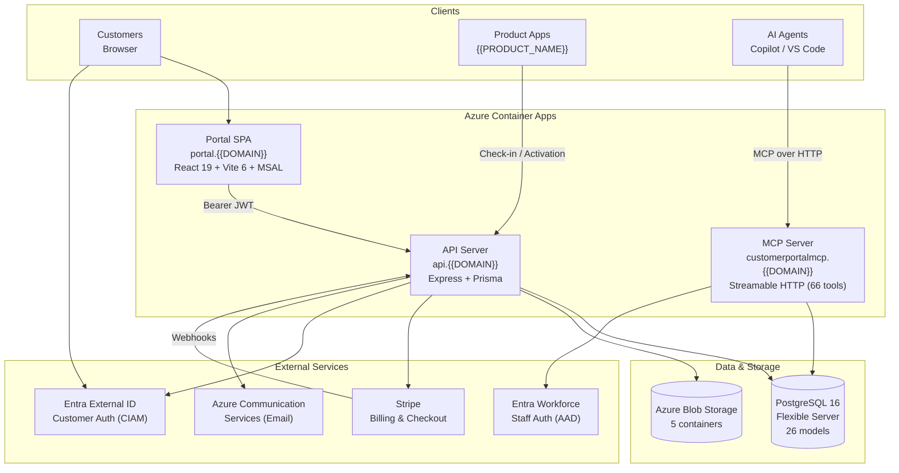
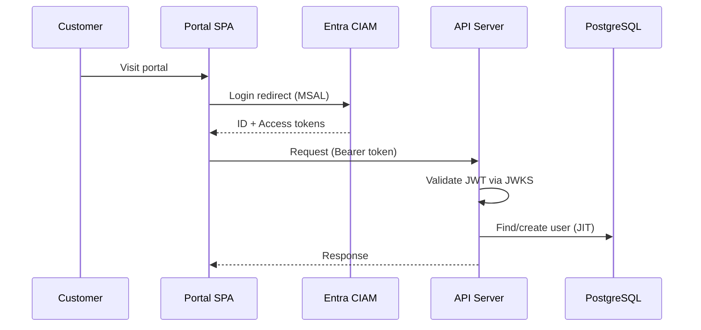
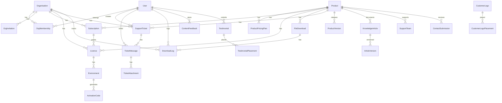
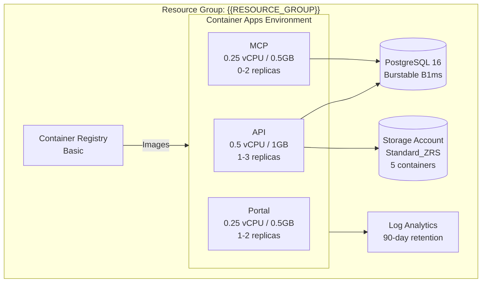
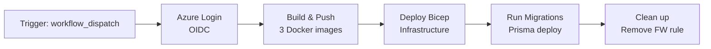
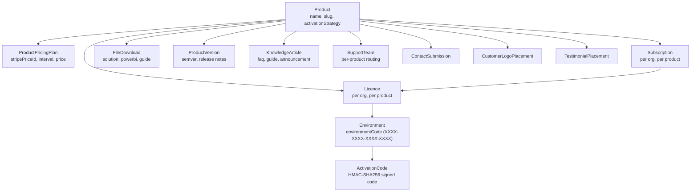

# Architecture

## Overview

The {{PROJECT_NAME}} Customer Portal is a multi-product SaaS platform that provides customer self-service for subscription management, licence activation, file downloads, knowledge base, support, and more. It is built as a pnpm monorepo deployed to Azure Container Apps.



## Monorepo Structure

```
├── package.json              # Root devDependencies (eslint, typescript)
├── pnpm-workspace.yaml       # Workspace: packages/*
├── pnpm-lock.yaml            # Single lockfile
├── tsconfig.base.json        # Shared TypeScript config
├── docker-compose.yml        # Local development
├── infra/
│   ├── main.bicep            # Azure infrastructure (IaC)
│   └── parameters.dev.json   # Dev parameter overrides
├── docs/                     # Documentation
└── packages/
    ├── shared/               # Types, Zod schemas, constants
    ├── api/                  # Express API + Prisma ORM
    ├── portal/               # React SPA
    └── mcp-server/           # MCP server for AI agents
```

| Package              | Description                                     | Runtime         |
| -------------------- | ----------------------------------------------- | --------------- |
| `@{{ORG_SCOPE}}/shared`     | Shared types, Zod validation schemas, constants | Build-time only |
| `@{{ORG_SCOPE}}/api`        | Express API with Prisma ORM, Stripe integration | Node.js 24      |
| `@{{ORG_SCOPE}}/portal`     | React 19 + Vite 6 SPA served via nginx          | nginx (static)  |
| `@{{ORG_SCOPE}}/mcp-server` | MCP server (Streamable HTTP) for AI agent tools | Node.js 24      |

## Authentication & Authorisation



### Customer Authentication (Portal + API)

- **Identity provider**: Microsoft Entra External ID (CIAM)
- **Tenant**: `{{ENTRA_CIAM_TENANT}}.ciamlogin.com`
- **Portal**: MSAL `@azure/msal-browser` with `sessionStorage` cache
- **API**: JWT validation via JWKS with cached signing keys (5 entries, 10min TTL)
- **JIT provisioning**: Users are created in the database on first login
- **Token claims**: `sub`/`oid` for identity, `emails[0]`/`email`/`preferred_username` for email

### Staff Authentication (MCP Server)

- **Identity provider**: Microsoft Entra Workforce (standard AAD)
- **Transport**: OAuth 2.0 over Streamable HTTP
- **Compliance**: RFC 9728 (protected resource metadata), RFC 8414 (authorization server metadata), RFC 7591 (dynamic client registration)
- **Token validation**: JWKS with RS256, accepts both v1 and v2 issuers
- **App role**: `MCP.Admin` required

### Role-Based Access Control

Organisation membership roles control access to org-scoped resources:

| Role        | Capabilities                             |
| ----------- | ---------------------------------------- |
| `owner`     | Full control, manage members, billing, transfer ownership |
| `admin`     | Manage org settings, members, roles (cannot change owner or transfer ownership) |
| `billing`   | Manage subscriptions, view licences      |
| `technical` | Manage licences, environments, downloads |

Staff access (`isStaff` flag on User) grants access to admin endpoints and the MCP server.

## Data Model

### Core Entities



### Key Design Decisions

- **Organisation-based multi-tenancy**: All billable resources (subscriptions, licences, tickets) belong to an Organisation, not a User
- **Auto-increment customer ID**: `Organisation.customerId` provides a human-friendly numeric ID (`CUST-0001`) alongside the UUID primary key
- **Stripe as source of truth for billing**: Subscription state is synced from Stripe via webhooks; the portal never stores card details
- **HMAC-SHA256 activation codes**: Licences generate signed activation codes compatible with product apps (e.g., {{PRODUCT_NAME}})
- **Flexible product features**: `Product.features` and `ProductPricingPlan.features` use JSON columns for display flexibility
- **SLA enforcement**: SlaPolicy per priority level with cron-based monitoring and escalation notifications
- **Knowledge base versioning**: ArticleVersion tracks all edits with version numbers and change notes
- **Team-based ticket routing**: Tickets auto-route to SupportTeam by product association

### Model Summary

| Category         | Models                                                                                                        | Count  |
| ---------------- | ------------------------------------------------------------------------------------------------------------- | ------ |
| **Core**         | Organisation, User, OrgMembership, OrgInvitation                                                              | 4      |
| **Products**     | Product, ProductPricingPlan, ProductVersion                                                                   | 3      |
| **Licensing**    | Subscription, Licence, Environment, ActivationCode                                                            | 4      |
| **Support**      | SupportTicket, TicketMessage, TicketAttachment, SlaPolicy, SlaNotificationLog, SupportTeam, SupportTeamMember | 7      |
| **Content**      | KnowledgeArticle, ArticleVersion, FileDownload, DownloadLog, ContentFeedback, ContactSubmission               | 6      |
| **Social Proof** | CustomerLogo, CustomerLogoPlacement, Testimonial, TestimonialPlacement                                        | 4      |
| **Total**        |                                                                                                               | **28** |

### Enums

| Enum                  | Values                                       |
| --------------------- | -------------------------------------------- |
| `ActivationStrategy`  | `none`, `mojo_ppm_hmac`                      |
| `OrgRole`             | `owner`, `admin`, `billing`, `technical`     |
| `SubscriptionPlan`    | `monthly`, `annual`                          |
| `SubscriptionStatus`  | `active`, `expired`, `cancelled`, `past_due` |
| `LicenceRecordType`   | `subscription`, `time_limited`, `unlimited`  |
| `TicketStatus`        | `open`, `in_progress`, `resolved`, `closed`  |
| `TicketPriority`      | `low`, `medium`, `high`                      |
| `DownloadCategory`    | `solution`, `powerbi`, `guide`               |
| `ArticleType`         | `faq`, `guide`, `announcement`               |
| `ContentType`         | `article`, `download`                        |
| `TestimonialStatus`   | `pending`, `approved`, `rejected`            |
| `TestimonialCategory` | `GENERAL`, `SUPPORT`, `PRODUCT`              |

## Azure Infrastructure

All infrastructure is defined in `infra/main.bicep` and deployed via GitHub Actions.



### Resources

| Resource                      | SKU / Tier                      | Purpose                     |
| ----------------------------- | ------------------------------- | --------------------------- |
| Azure Container Registry      | Basic                           | Docker image storage        |
| PostgreSQL Flexible Server 16 | Burstable B1ms, 32GB            | Primary database            |
| Storage Account (StorageV2)   | Standard_ZRS                    | File storage (Blob)         |
| Azure Communication Services  | —                               | Email notifications         |
| Container Apps Environment    | —                               | Container orchestration     |
| Log Analytics Workspace       | PerGB2018, 90-day retention     | Centralised logging         |
| Container App: API            | 0.5 vCPU / 1GB, 1–3 replicas    | API server                  |
| Container App: Portal         | 0.25 vCPU / 0.5GB, 1–2 replicas | SPA hosting                 |
| Container App: MCP            | 0.25 vCPU / 0.5GB, 0–2 replicas | MCP server (scales to zero) |

### Storage Containers

| Container            | Access Level | Purpose                                    |
| -------------------- | ------------ | ------------------------------------------ |
| `downloads`          | Private      | Solution files, guides, Power BI templates |
| `product-assets`     | Public blob  | Product icons and logos                    |
| `kb-images`          | Public blob  | Knowledge base article images              |
| `ticket-attachments` | Private      | Support ticket file attachments            |
| `ticket-images`      | Public blob  | Inline ticket images                       |

### Networking

- All Container Apps have external ingress with managed TLS certificates
- Custom domains: `api.{{DOMAIN}}`, `portal.{{DOMAIN}}`, `customerportalmcp.{{DOMAIN}}`
- PostgreSQL accepts connections from Azure services only (firewall rule `0.0.0.0`)
- CORS on the API allows `portal.{{DOMAIN}}` + Power Apps/Dynamics domains
- Blob storage: private containers use time-limited SAS URLs; public containers serve directly

### Auto-scaling

| Service | Min Replicas | Max Replicas | Scale Trigger               |
| ------- | ------------ | ------------ | --------------------------- |
| API     | 1            | 3            | 50 concurrent HTTP requests |
| Portal  | 1            | 2            | — (static content)          |
| MCP     | 0            | 2            | 20 concurrent HTTP requests |

## Services

The API includes several background and utility services:

| Service          | File                           | Purpose                                                                                                                                    |
| ---------------- | ------------------------------ | ------------------------------------------------------------------------------------------------------------------------------------------ |
| Email            | `services/email.ts`            | Send transactional emails via Azure Communication Services (invitations, ticket replies, SLA alerts, version notifications, contact forms) |
| Activation       | `services/activation.ts`       | HMAC-SHA256 activation code generation and verification                                                                                    |
| Stripe           | `services/stripe.ts`           | Stripe API client (v2025-02-24.acacia) for checkout and subscription management                                                            |
| Ticket Blob      | `services/ticketBlob.ts`       | Azure Blob Storage for ticket attachments (upload, 15-min SAS URL generation; 10MB/file, 5 files/message)                                  |
| SLA Checker      | `services/sla-checker.ts`      | Cron: monitors open tickets against SLA policies, sends warning/breach notifications to escalation team                                    |
| Version Notifier | `services/version-notifier.ts` | Cron: emails customers about new product versions (finds unnotified ProductVersions)                                                       |

## Scheduled Jobs (Cron)

The API exposes a secret-protected cron endpoint that is called by an **external scheduler** (e.g. Azure Container Apps Job, GitHub Actions scheduled workflow, or any HTTP cron service like cron-job.org).

### Endpoint

```
POST /api/cron/run
Header: x-cron-secret: {CRON_SECRET}
```

### Jobs Executed

| Job                  | Service               | What it does                                                                                                                                           |
| -------------------- | --------------------- | ------------------------------------------------------------------------------------------------------------------------------------------------------ |
| **SLA Checker**      | `sla-checker.ts`      | Finds open/in-progress tickets, checks age against SlaPolicy thresholds, creates SlaNotificationLog entries, emails escalation team + assignee via ACS |
| **Version Notifier** | `version-notifier.ts` | Finds ProductVersions with `notifiedAt === null`, emails all users in orgs with active licences for that product, marks as notified                    |

### Recommended Schedule

| Environment | Frequency        | Method                                                                                |
| ----------- | ---------------- | ------------------------------------------------------------------------------------- |
| Production  | Every 15 minutes | Azure Container Apps Job or external HTTP cron                                        |
| Development | Manual           | `curl -X POST http://localhost:3001/api/cron/run -H 'x-cron-secret: dev-cron-secret'` |

### Configuration

| Variable      | Default           | Description                                                                                  |
| ------------- | ----------------- | -------------------------------------------------------------------------------------------- |
| `CRON_SECRET` | `dev-cron-secret` | Shared secret between scheduler and API. Must be set to a strong random value in production. |

### Response

```json
{
  "sla": { "warnings": 2, "breaches": 1 },
  "versionsNotified": 3,
  "timestamp": "2026-03-30T10:00:00.000Z"
}
```

### Deduplication

Both jobs are idempotent:

- SLA Checker uses `SlaNotificationLog` with `@@unique([ticketId, type])` to prevent duplicate alerts
- Version Notifier sets `notifiedAt` on `ProductVersion` after sending, so re-runs skip already-notified versions

## Azure Communication Services (Email)

The API sends transactional emails via ACS using the `@azure/communication-email` SDK. Email is **optional** — if `ACS_CONNECTION_STRING` is not set, emails are logged to console but not sent.

### Email Templates

| Template        | Trigger                         | Recipients                             |
| --------------- | ------------------------------- | -------------------------------------- |
| Org Invitation  | User invited to organisation    | Invitee                                |
| Ticket Reply    | Staff replies to support ticket | Ticket creator                         |
| Ticket Created  | Customer creates support ticket | Assigned team escalation contacts      |
| Ticket Assigned | Ticket assigned to staff member | Assigned staff                         |
| Contact Form    | Customer submits contact form   | Staff (configured recipients)          |
| SLA Warning     | Ticket approaching SLA breach   | Escalation contacts + assignee         |
| SLA Breach      | Ticket has breached SLA         | Escalation contacts + assignee         |
| Version Release | New product version published   | All users in orgs with active licences |

### Configuration

| Variable                | Required | Default                  | Description                    |
| ----------------------- | -------- | ------------------------ | ------------------------------ |
| `ACS_CONNECTION_STRING` | No       | `''` (disabled)          | ACS resource connection string |
| `ACS_SENDER_ADDRESS`    | No       | `no-reply@{{ORG_SCOPE}}.com.au` | Verified sender address        |

### ACS Resource Setup

1. Create Azure Communication Services resource in Azure Portal
2. Under **Email** → **Domains**, add and verify a custom domain (e.g. `{{DOMAIN}}`)
3. Add sender address (e.g. `no-reply@{{ORG_SCOPE}}.com.au`) under the verified domain
4. Copy the connection string from **Keys** → set as `ACS_CONNECTION_STRING`
5. The `ACS_SENDER_ADDRESS` must match a verified sender in the ACS domain

## Entra External ID (CIAM) Setup

The portal and API authenticate customers via Microsoft Entra External ID (CIAM). This is a **separate tenant** from the workforce (staff) tenant.

### Tenant Configuration

| Setting         | Value                           |
| --------------- | ------------------------------- |
| Tenant type     | External (CIAM)                 |
| Authority       | `{tenant}.ciamlogin.com`        |
| Sign-up/sign-in | Email + password (self-service) |
| Token version   | v2.0                            |

### App Registration (Portal + API)

| Setting         | Portal App                                              | API App  |
| --------------- | ------------------------------------------------------- | -------- |
| Type            | SPA                                                     | Web API  |
| Redirect URIs   | `https://portal.{{DOMAIN}}`, `http://localhost:5173` | —        |
| Expose scopes   | —                                                       | `access` |
| API permissions | API app's `access` scope                                | —        |
| Token claims    | `email`, `name`                                         | —        |

### Required Environment Variables

| Variable                      | Package | Description                                                |
| ----------------------------- | ------- | ---------------------------------------------------------- |
| `ENTRA_EXTERNAL_ID_TENANT_ID` | API     | CIAM tenant GUID                                           |
| `ENTRA_EXTERNAL_ID_CLIENT_ID` | API     | API app registration client ID                             |
| `VITE_ENTRA_CLIENT_ID`        | Portal  | SPA app registration client ID (compile-time)              |
| `VITE_ENTRA_AUTHORITY`        | Portal  | `https://{tenant}.ciamlogin.com/{tenantId}` (compile-time) |

## CI/CD Pipeline

### Pull Requests (`ci.yml`)

1. Lint all packages (`eslint`)
2. Type-check all packages (`tsc --noEmit`)
3. Build all packages

### Deployment (`deploy.yml`)

Triggered manually via `workflow_dispatch` (environment selector: `prod`).



1. **Azure Login** — Federated identity (OIDC), no stored credentials
2. **Build & Push** — Three Docker images built and pushed to ACR tagged with commit SHA
3. **Deploy Infrastructure** — `az deployment group create` with Bicep template
4. **Run Migrations** — Temporary firewall rule for GitHub Actions runner IP, `prisma migrate deploy`, then firewall rule removed

## External Service Integrations

### Stripe

- **Checkout**: Portal redirects to Stripe Checkout; no billing UI in the app
- **Webhooks**: `POST /api/webhooks/stripe` with raw body signature verification
- **Events handled**: `checkout.session.completed`, `invoice.paid`, `invoice.payment_failed`, `customer.subscription.deleted`, `customer.subscription.updated`
- **Idempotency**: All webhook handlers check for existing records before creating

### Azure Blob Storage

- **5 containers**: `downloads` (private), `product-assets` (public), `kb-images` (public), `ticket-attachments` (private), `ticket-images` (public)
- **Access**: Private containers use 15-minute SAS URLs generated server-side; public containers serve directly
- **Protection**: ZRS replication, blob versioning, 30-day soft delete
- **Upload limits**: Tickets — 10MB per file, 5 files per message; Admin uploads — 500MB for downloads, 5MB for images
- **Audit**: File downloads logged in `download_logs` table

### Azure Communication Services

- **Email notifications**: Invitations, ticket replies (customer/staff), ticket creation (staff), ticket assignment, SLA warnings/breaches, new version announcements, contact form submissions
- **Sender**: `no-reply@{{ORG_SCOPE}}.com.au` (configurable via `ACS_SENDER_ADDRESS`)

## Product-Centric Data Model

The platform is **multi-product**: every billable and content entity hangs off a `Product`. Each product has its own subscriptions, licences, downloads, knowledge base, support team, versions, customer logos, and testimonials.



### Product → Licence → Environment → Activation Code

This is the per-product licensing chain:

1. **Product** defines `activationStrategy` (`none` or `mojo_ppm_hmac`) — determines whether activation codes can be generated
2. **Subscription** (Stripe-managed) is created per organisation per product via webhook on `checkout.session.completed`
3. **Licence** is created alongside the subscription (1:1 for subscription type) and links to both the organisation and product
4. **Environments** are registered by members against a licence (up to `maxEnvironments`). Each has a unique `environmentCode` in `XXXX-XXXX-XXXX-XXXX` hex format
5. **Activation Codes** are generated per environment using HMAC-SHA256, embedding the licence type and expiry date

### Activation Code Generation

The activation code is a **product-agnostic** signed payload — the product identity flows through the licence → subscription chain, not the code itself:

```
Payload: {fingerprint}|{licenceTypeCode}|{endDate or subscriptionId}
Code:    base64url(payloadBytes).base64url(HMAC-SHA256(payloadBytes, hmacKey))
```

Where:
- `fingerprint` = environment code with hyphens stripped, lowercased (16 hex chars)
- `licenceTypeCode` = `100000001` (time-limited), `100000002` (unlimited), `100000003` (subscription)
- `endDate` = subscription end date or manual expiry, set to 23:59:59 UTC

Portal users can only generate codes for **subscription** licences. Staff can generate codes for any licence type via admin endpoints.

### Check-in (Product App → API)

Product applications (e.g. {{PRODUCT_NAME}}) call `POST /api/checkin` daily with their activation code. The API:
1. Verifies the HMAC signature
2. Looks up the environment, licence, and subscription
3. Returns a **renewed activation code** (fresh dates), licence status, contact emails, and update availability
4. Rate limited to 10 requests/hour per IP

### What Varies Per Product

When adding a new product, these entities are product-scoped:

| Entity | Relationship | Impact |
|--------|-------------|--------|
| `ProductPricingPlan` | Product has many | Different pricing per product |
| `Subscription` | Per org, per product | Org can subscribe to multiple products |
| `Licence` | Per org, per product | Each product grants a separate licence |
| `FileDownload` | Product has many | Downloads categorised per product |
| `ProductVersion` | Product has many | Independent release cycles |
| `KnowledgeArticle` | Optional product scope | Can be product-specific or general |
| `SupportTeam` | 1:1 with product | Tickets auto-route to product team |
| `SupportTicket` | Optional product scope | Customer selects product when filing |
| `CustomerLogoPlacement` | Product or landing page | Logos shown on specific product pages |
| `TestimonialPlacement` | Product or landing page | Testimonials shown per product |

## Deep Links

All deep links use `PORTAL_URL` (env var, default `http://localhost:5173`). The portal is an SPA with client-side routing — all paths must be handled by React Router.

### Email Deep Links

| Email Template | Deep Link Pattern | Portal Route | Recipients |
|---------------|-------------------|--------------|------------|
| Org Invitation | `${PORTAL_URL}/accept-invite/${token}` | `/accept-invite/:token` | Invitee (must be authenticated) |
| Ticket Reply (customer) | `${PORTAL_URL}/support/${ticketId}` | `/support/:ticketId` | Ticket creator |
| Ticket Created (staff) | `${PORTAL_URL}/admin/support/tickets/${ticketId}` | `/admin/support/tickets/:ticketId` | Support team escalation contacts |
| Ticket Assigned (staff) | `${PORTAL_URL}/admin/support/tickets/${ticketId}` | `/admin/support/tickets/:ticketId` | Assigned staff member |
| SLA Warning (staff) | `${PORTAL_URL}/admin/support/tickets/${ticketId}` | `/admin/support/tickets/:ticketId` | Escalation contacts + assignee |
| SLA Breach (staff) | `${PORTAL_URL}/admin/support/tickets/${ticketId}` | `/admin/support/tickets/:ticketId` | Escalation contacts + assignee |
| Version Release | `${PORTAL_URL}/downloads` | `/downloads` | All users with active licences |
| Contact Form | *(no deep link — email content only)* | — | Staff recipients |

### Stripe Redirect URLs

| Flow | URL Pattern | Portal Route |
|------|------------|---------------|
| Checkout Success | `${PORTAL_URL}/checkout/success?session_id={CHECKOUT_SESSION_ID}` | `/checkout/success` |
| Checkout Cancel | `${PORTAL_URL}/products/${slug}` | `/products/:slug` |
| Billing Portal Return | `${PORTAL_URL}/billing` | `/billing` |

### Auth Flow Deep Links

| Flow | Description | Target |
|------|------------|--------|
| MSAL Login Redirect | After Entra CIAM login, MSAL returns to `window.location.origin` | `/` (Landing) |
| Post-Login Router | If pending purchase in localStorage → Stripe checkout; if no org → `/onboarding`; else → `/dashboard` | `/post-login` |
| Invite Accept | User clicks invite email → `/accept-invite/:token` → if not logged in, saves path and redirects to login | `/accept-invite/:token` |
