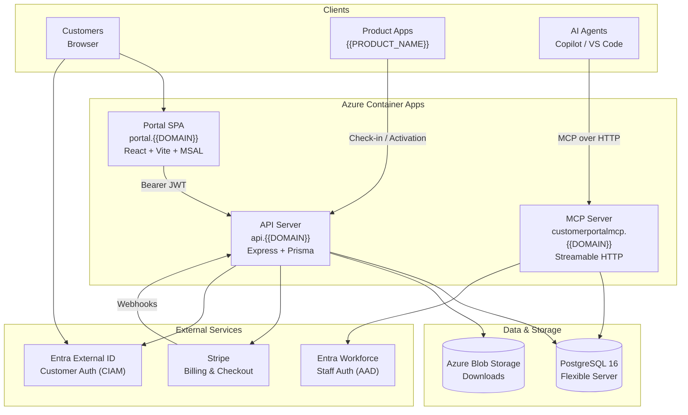
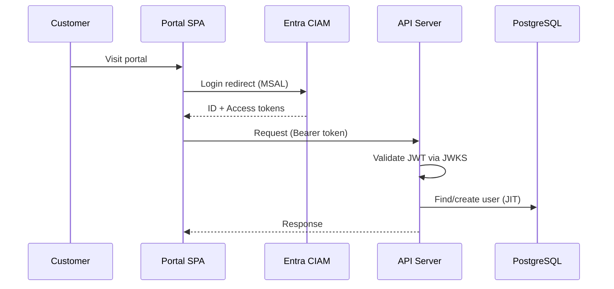
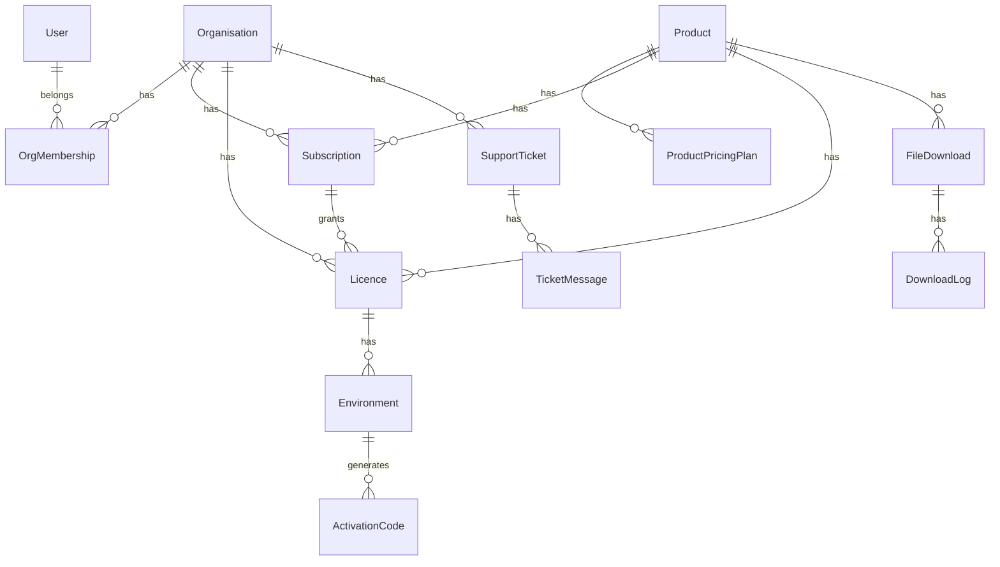
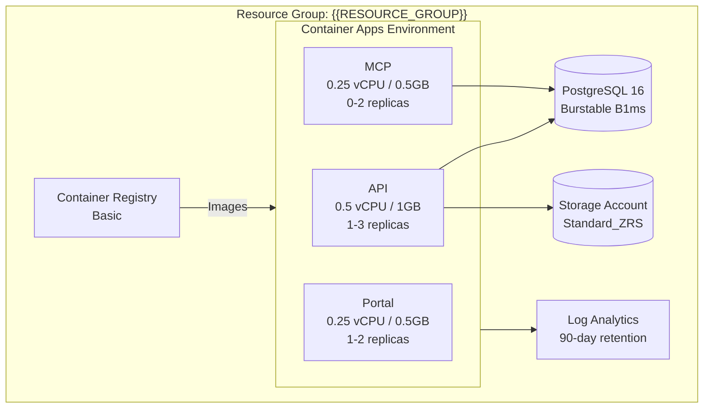
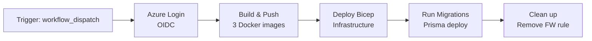

# Architecture

## Overview

The {{PROJECT_NAME}} Customer Portal is a multi-product SaaS platform that provides customer self-service for subscription management, licence activation, file downloads, and support. It is built as a pnpm monorepo deployed to Azure Container Apps.



## Monorepo Structure

```
├── package.json              # Root devDependencies (eslint, typescript)
├── pnpm-workspace.yaml       # Workspace: packages/*
├── pnpm-lock.yaml            # Single lockfile
├── tsconfig.base.json        # Shared TypeScript config
├── docker-compose.yml        # Local development
├── infra/
│   ├── main.bicep            # Azure infrastructure (IaC)
│   └── parameters.dev.json   # Dev parameter overrides
└── packages/
    ├── shared/               # Types, Zod schemas, constants
    ├── api/                  # Express API + Prisma ORM
    ├── portal/               # React SPA
    └── mcp-server/           # MCP server for AI agents
```

| Package              | Description                                     | Runtime         |
| -------------------- | ----------------------------------------------- | --------------- |
| `@{{ORG_SCOPE}}/shared`     | Shared types, Zod validation schemas, constants | Build-time only |
| `@{{ORG_SCOPE}}/api`        | Express API with Prisma ORM, Stripe integration | Node.js 24      |
| `@{{ORG_SCOPE}}/portal`     | React + Vite SPA served via nginx               | nginx (static)  |
| `@{{ORG_SCOPE}}/mcp-server` | MCP server (Streamable HTTP) for AI agent tools | Node.js 24      |

## Authentication & Authorisation



### Customer Authentication (Portal + API)

- **Identity provider**: Microsoft Entra External ID (CIAM)
- **Tenant**: `{{ENTRA_CIAM_TENANT}}.ciamlogin.com`
- **Portal**: MSAL `@azure/msal-browser` with `sessionStorage` cache
- **API**: JWT validation via JWKS with cached signing keys (5 entries, 10min TTL)
- **JIT provisioning**: Users are created in the database on first login
- **Token claims**: `sub`/`oid` for identity, `emails[0]`/`email`/`preferred_username` for email

### Staff Authentication (MCP Server)

- **Identity provider**: Microsoft Entra Workforce (standard AAD)
- **Transport**: OAuth 2.0 over Streamable HTTP
- **Compliance**: RFC 9728 (protected resource metadata), RFC 8414 (authorization server metadata), RFC 7591 (dynamic client registration)
- **Token validation**: JWKS with RS256, accepts both v1 and v2 issuers

### Role-Based Access Control

Organisation membership roles control access to org-scoped resources:

| Role        | Capabilities                             |
| ----------- | ---------------------------------------- |
| `owner`     | Full control, manage members, billing    |
| `admin`     | Manage members, view billing             |
| `billing`   | Manage subscriptions, view licences      |
| `technical` | Manage licences, environments, downloads |

Staff access (`isStaff` flag on User) grants access to admin endpoints and the MCP server.

## Data Model

### Core Entities



### Key Design Decisions

- **Organisation-based multi-tenancy**: All billable resources (subscriptions, licences, tickets) belong to an Organisation, not a User
- **Auto-increment customer ID**: `Organisation.customerId` provides a human-friendly numeric ID alongside the UUID primary key
- **Stripe as source of truth for billing**: Subscription state is synced from Stripe via webhooks; the portal never stores card details
- **HMAC-SHA256 activation codes**: Licences generate signed activation codes compatible with product Code Apps (e.g., {{PRODUCT_NAME}})
- **Flexible product features**: `Product.features` and `ProductPricingPlan.features` use JSON columns for display flexibility

## Azure Infrastructure

All infrastructure is defined in `infra/main.bicep` and deployed via GitHub Actions.



### Resources

| Resource                      | SKU / Tier                      | Purpose                     |
| ----------------------------- | ------------------------------- | --------------------------- |
| Azure Container Registry      | Basic                           | Docker image storage        |
| PostgreSQL Flexible Server 16 | Burstable B1ms, 32GB            | Primary database            |
| Storage Account (StorageV2)   | Standard_ZRS                    | File downloads (Blob)       |
| Container Apps Environment    | —                               | Container orchestration     |
| Log Analytics Workspace       | PerGB2018                       | Centralised logging         |
| Container App: API            | 0.5 vCPU / 1GB, 1–3 replicas    | API server                  |
| Container App: Portal         | 0.25 vCPU / 0.5GB, 1–2 replicas | SPA hosting                 |
| Container App: MCP            | 0.25 vCPU / 0.5GB, 0–2 replicas | MCP server (scales to zero) |

### Networking

- All Container Apps have external ingress with managed TLS certificates
- Custom domains: `api.{{DOMAIN}}`, `portal.{{DOMAIN}}`, `customerportalmcp.{{DOMAIN}}`
- PostgreSQL accepts connections from Azure services only (firewall rule `0.0.0.0`)
- CORS on the API allows only `https://portal.{{DOMAIN}}`
- Blob storage has public access disabled; downloads use time-limited SAS URLs

### Auto-scaling

| Service | Min Replicas | Max Replicas | Scale Trigger               |
| ------- | ------------ | ------------ | --------------------------- |
| API     | 1            | 3            | 50 concurrent HTTP requests |
| Portal  | 1            | 2            | — (static content)          |
| MCP     | 0            | 2            | 20 concurrent HTTP requests |

## CI/CD Pipeline

### Pull Requests (`ci.yml`)

1. Lint all packages (`eslint`)
2. Type-check all packages (`tsc --noEmit`)
3. Build all packages

### Deployment (`deploy.yml`)

Triggered manually via `workflow_dispatch` (environment selector: `prod`).



1. **Azure Login** — Federated identity (OIDC), no stored credentials
2. **Build & Push** — Three Docker images built and pushed to ACR tagged with commit SHA
3. **Deploy Infrastructure** — `az deployment group create` with Bicep template
4. **Run Migrations** — Temporary firewall rule for GitHub Actions runner IP, `prisma migrate deploy`, then firewall rule removed

## External Service Integrations

### Stripe

- **Checkout**: Portal redirects to Stripe Checkout; no billing UI in the app
- **Webhooks**: `POST /api/webhooks/stripe` with raw body signature verification
- **Events handled**: `checkout.session.completed`, `invoice.paid`, `invoice.payment_failed`, `customer.subscription.deleted`, `customer.subscription.updated`
- **Idempotency**: All webhook handlers check for existing records before creating

### Azure Blob Storage

- **Container**: `downloads` (private, no public access)
- **Access**: Time-limited SAS URLs generated server-side
- **Categories**: `solution`, `powerbi`, `guide`
- **Audit**: All downloads logged in `download_logs` table
