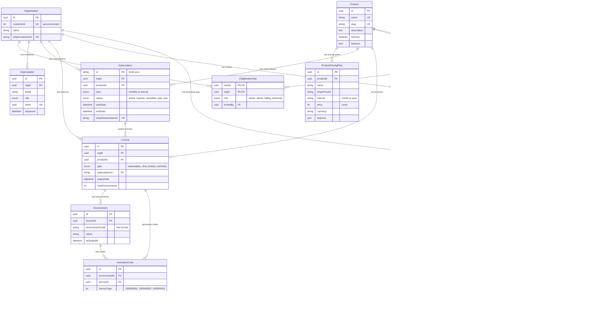
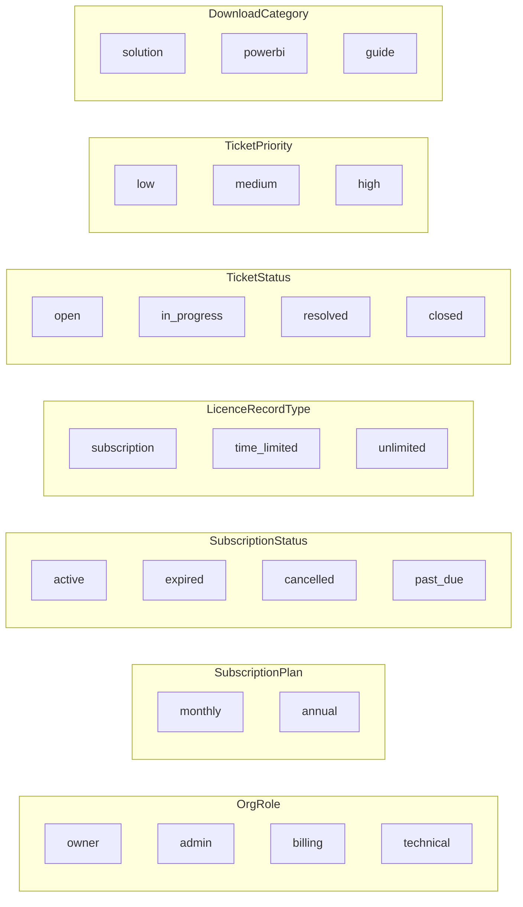
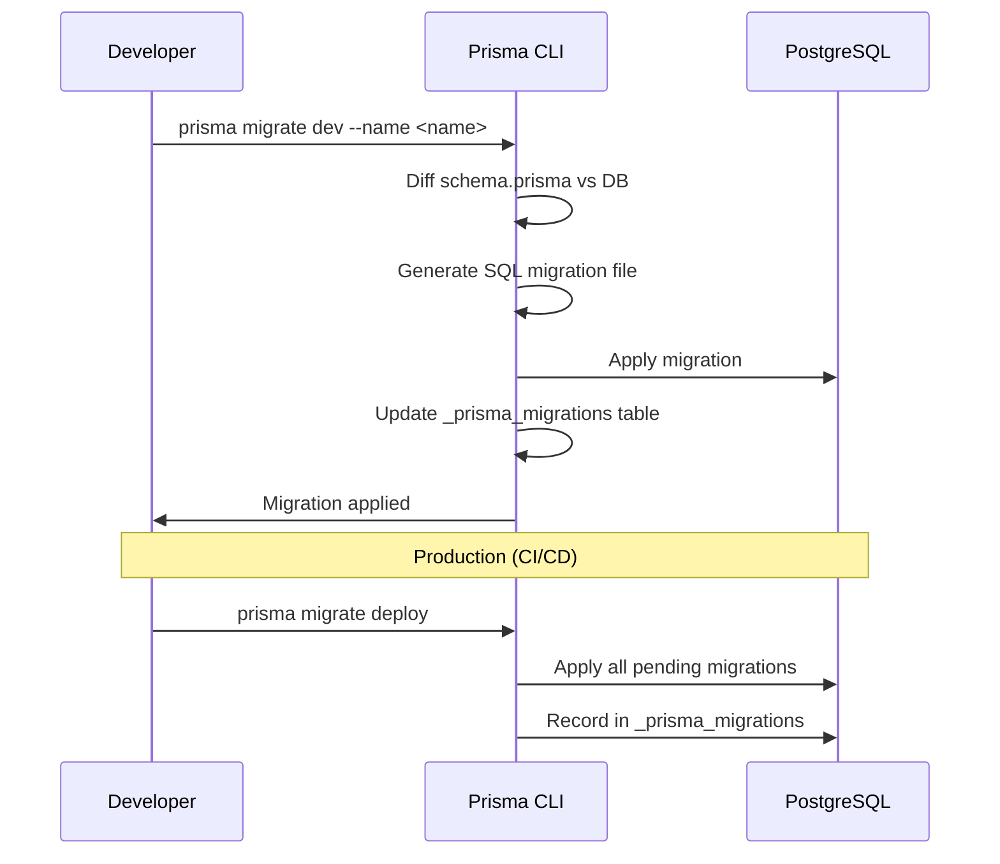
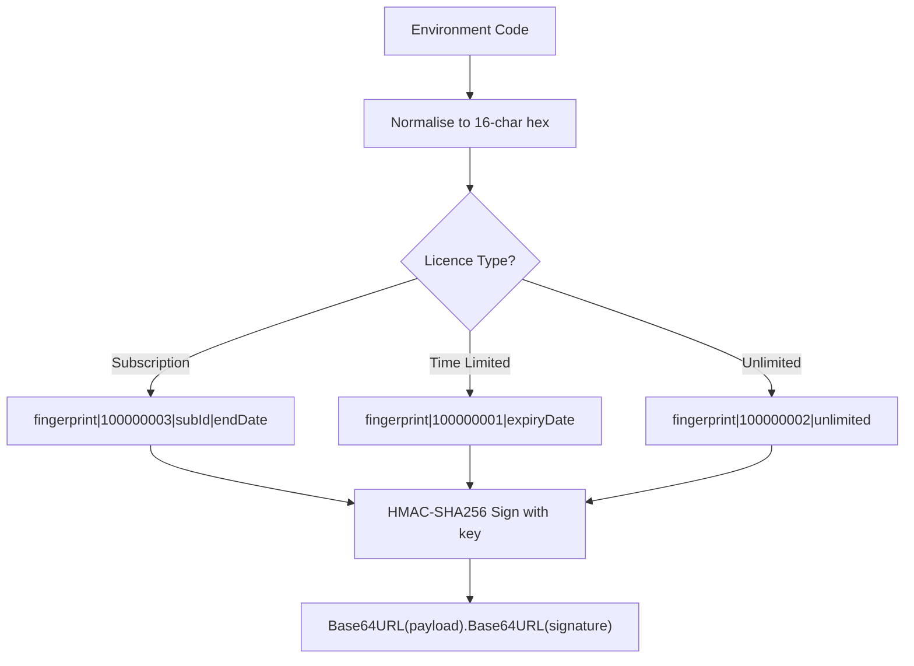
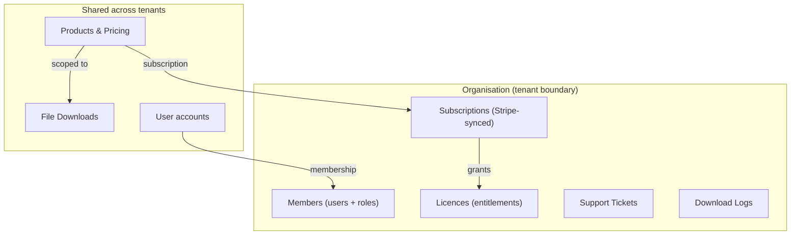

# Database

## Overview

The {{PROJECT_NAME}} Customer Portal uses PostgreSQL 16 via Azure Database for PostgreSQL Flexible Server, accessed through Prisma ORM. The database stores all organisation, user, subscription, licence, support, and download data.

## Entity Relationship Diagram



## Tables

### Core Business

| Table | Description | Key Relationships |
|-------|-------------|-------------------|
| `organisations` | Customer organisations, each with a unique `customer_id` and optional Stripe customer | Parent of memberships, subscriptions, licences, tickets |
| `products` | Product catalogue (e.g. {{PRODUCT_NAME}}) with slug, description, features JSON | Parent of pricing plans, subscriptions, licences, downloads |
| `product_pricing_plans` | Per-product pricing (Stripe price IDs, interval, price in cents) | Belongs to product |
| `subscriptions` | Active billing relationships, synced from Stripe webhooks | Belongs to org + product, grants licences |
| `licences` | Entitlements (subscription-linked, time-limited, or unlimited) | Belongs to org + product, optionally linked to subscription |
| `environments` | Registered product installations (environment code = hardware fingerprint) | Belongs to licence |
| `activation_codes` | Audit trail of HMAC-signed activation codes generated | Belongs to environment + licence |

### Users & Access

| Table | Description | Key Relationships |
|-------|-------------|-------------------|
| `users` | All portal users, linked to Entra via `entra_object_id` | Member of organisations via `org_memberships` |
| `org_memberships` | Organisation membership with role (owner/admin/billing/technical) | Composite PK: `user_id` + `org_id` |
| `org_invitations` | Pending invitations with token and expiry | Belongs to organisation |

### Support & Downloads

| Table | Description | Key Relationships |
|-------|-------------|-------------------|
| `support_tickets` | Customer support requests with status and priority | Belongs to org + product + user |
| `ticket_messages` | Messages within a ticket (supports internal staff notes) | Belongs to ticket + user |
| `file_downloads` | Downloadable files stored in Azure Blob Storage | Belongs to product |
| `download_logs` | Audit log of all file downloads | Belongs to file + user + org |

## Enums



## Indexes

Key indexes beyond primary keys:

| Table | Columns | Purpose |
|-------|---------|---------|
| `organisations` | `customer_id` (unique) | Look up by numeric customer ID |
| `organisations` | `stripe_customer_id` (unique) | Look up by Stripe customer |
| `users` | `email` (unique) | JIT provisioning, invitations |
| `users` | `entra_object_id` (unique) | Token-based authentication |
| `subscriptions` | `org_id` | Org subscription list |
| `subscriptions` | `product_id` | Product subscription list |
| `subscriptions` | `stripe_subscription_id` (unique) | Webhook event handling |
| `licences` | `org_id`, `product_id`, `subscription_id` | Licence lookups |
| `environments` | `licence_id` + `environment_code` (unique) | Prevent duplicate registrations |
| `org_invitations` | `email`, `token` (unique) | Invitation acceptance |
| `support_tickets` | `org_id`, `product_id`, `user_id` | Ticket filtering |
| `ticket_messages` | `ticket_id` | Message retrieval |
| `file_downloads` | `product_id` | Product download list |
| `download_logs` | `file_id`, `user_id`, `org_id` | Audit queries |
| `activation_codes` | `environment_id`, `licence_id` | Code history |

## Migrations

Migrations are managed by Prisma Migrate and stored in `packages/api/prisma/migrations/`:

| Migration | Description |
|-----------|-------------|
| `0001_init` | Initial schema: all tables, indexes, and enums |
| `0002_remove_slug_add_customer_id` | Replace org slug with auto-increment `customer_id` |

### Running Migrations

```bash
# Development: create and apply a new migration
cd packages/api
npx prisma migrate dev --name <migration_name>

# Production: apply pending migrations (no prompts)
npx prisma migrate deploy
```

### Migration Flow



## Activation Code Structure

Activation codes use HMAC-SHA256 signing. The code format is `Base64URL(payload).Base64URL(signature)`.



## Multi-Tenancy Model



All billable resources (subscriptions, licences, tickets, download logs) are scoped to an Organisation. Users can belong to multiple organisations. Products and file downloads are shared across all tenants.
