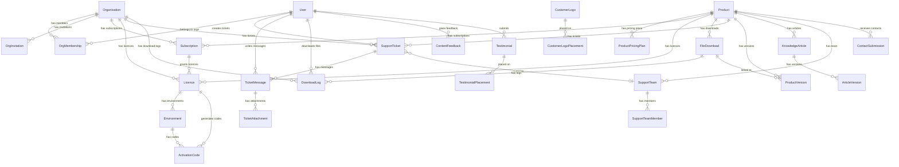

# Database

## Overview

The {{PROJECT_NAME}} Customer Portal uses PostgreSQL 16 via Azure Database for PostgreSQL Flexible Server, accessed through Prisma ORM. The database stores all organisation, user, subscription, licence, support, content, and social proof data across 26 models and 12 enums.

## Entity Relationship Diagram



## Tables

### Core Business

| Table | Description | Key Fields |
|-------|-------------|------------|
| `organisations` | Customer organisations | `id` (UUID), `customerId` (auto-increment, unique), `name`, `stripeCustomerId` (unique, nullable) |
| `users` | All portal users (JIT provisioned) | `id` (UUID), `email` (unique), `name`, `jobTitle`, `phone`, `mobile`, `entraObjectId` (unique), `isStaff`, `marketingOptOut` |
| `org_memberships` | Organisation membership with role | Composite PK: `userId + orgId`, `role` (OrgRole), `invitedBy`, `acceptedAt` |
| `org_invitations` | Pending invitations with token and expiry | `id`, `orgId`, `email`, `role`, `token` (unique), `expiresAt` |

### Products & Pricing

| Table | Description | Key Fields |
|-------|-------------|------------|
| `products` | Product catalogue | `id`, `name` (unique), `slug` (unique), `description`, `iconUrl`, `logoUrl`, `isActive`, `activationStrategy`, `features` (JSON), `sortOrder` |
| `product_pricing_plans` | Per-product pricing | `id`, `productId` (FK), `name`, `stripePriceId`, `interval` (month/year), `price` (cents), `currency`, `features` (JSON), `isActive`, `sortOrder` |
| `product_versions` | Release management | `id`, `productId` (FK), `downloadId` (FK, nullable), `version`, `releaseNotes`, `releasedAt`, `downloadUrl`, `isLatest`, `notifiedAt` — unique: `productId + version` |

### Subscriptions & Licensing

| Table | Description | Key Fields |
|-------|-------------|------------|
| `subscriptions` | Stripe-driven billing | `id` (SUB-xxxx format), `orgId`, `productId`, `plan`, `status`, `startDate`, `endDate`, `stripeSubscriptionId` (unique) |
| `licences` | Entitlements (subscription, time-limited, unlimited) | `id`, `orgId`, `productId`, `type` (LicenceRecordType), `subscriptionId` (nullable), `expiryDate` (nullable), `maxEnvironments` (default 5) |
| `environments` | Registered installations | `id`, `licenceId`, `environmentCode` (XXXX-XXXX-XXXX-XXXX), `name`, `activatedAt` — unique: `licenceId + environmentCode` |
| `activation_codes` | Audit trail of HMAC-signed codes | `id`, `environmentId`, `licenceId`, `licenceType` (100000001/2/3), `code`, `endDate` |

### Support System

| Table | Description | Key Fields |
|-------|-------------|------------|
| `support_tickets` | Customer support requests | `id`, `orgId`, `userId`, `productId`, `teamId` (nullable, set null on delete), `assigneeId` (nullable), `subject`, `status`, `priority`, `sentiment` (1-5 nullable), `closedAt` |
| `ticket_messages` | Messages within a ticket | `id`, `ticketId`, `userId`, `body`, `isInternal` (default false) |
| `ticket_attachments` | File attachments on messages | `id`, `messageId`, `fileName`, `contentType`, `fileSize`, `blobPath` |
| `sla_policies` | SLA thresholds per priority | `id`, `priority` (unique), `firstResponseMinutes`, `resolutionMinutes`, `staleWarningMinutes` |
| `sla_notification_logs` | SLA breach/warning tracking | `id`, `ticketId`, `type` (warning/breach), `notifiedAt` |
| `support_teams` | Product-based support teams | `id`, `name` (unique), `description`, `productId` (unique, nullable), `isDefault` |
| `support_team_members` | Team membership | Composite PK: `teamId + userId`, `isEscalation` (default false) |

### Content & Knowledge

| Table | Description | Key Fields |
|-------|-------------|------------|
| `knowledge_articles` | Knowledge base articles | `id`, `productId` (nullable), `title`, `slug` (unique), `body`, `type` (ArticleType), `isPublished`, `sortOrder` |
| `article_versions` | Article edit history | `id`, `articleId`, `version`, `title`, `body`, `type`, `editedById`, `editedBy`, `changeNote` — unique: `articleId + version` |
| `file_downloads` | Downloadable files | `id`, `productId`, `name`, `description`, `category` (DownloadCategory), `version`, `blobPath`, `fileSize` (BigInt) |
| `download_logs` | Audit trail of downloads | `id`, `fileId`, `userId`, `orgId`, `downloadedAt` |
| `content_feedback` | Thumbs up/down on content | `id`, `contentType` (ContentType), `contentId`, `userId`, `isHelpful` — unique: `contentType + contentId + userId` |
| `contact_submissions` | Contact form submissions | `id`, `productId` (nullable), `firstName`, `lastName`, `email`, `phone`, `company`, `message` |

### Social Proof

| Table | Description | Key Fields |
|-------|-------------|------------|
| `customer_logos` | Customer logo carousel | `id`, `name`, `logoUrl`, `website`, `sortOrder`, `isActive` |
| `customer_logo_placements` | Page placement for logos | `id`, `logoId`, `productId` (nullable), `pageType` (landing/product) — unique: `logoId + pageType + productId` |
| `testimonials` | Customer testimonials | `id`, `userId` (nullable), `productId` (nullable), `quote`, `authorName`, `jobTitle`, `company`, `rating` (1-5), `category` (TestimonialCategory), `status` (TestimonialStatus) |
| `testimonial_placements` | Page placement for testimonials | `id`, `testimonialId`, `productId`, `pageType` (landing/product) |

## Enums

| Enum | Values | Usage |
|------|--------|-------|
| `ActivationStrategy` | `none`, `mojo_ppm_hmac` | Product activation method |
| `OrgRole` | `owner`, `admin`, `billing`, `technical` | Organisation membership role |
| `SubscriptionPlan` | `monthly`, `annual` | Billing interval |
| `SubscriptionStatus` | `active`, `expired`, `cancelled`, `past_due` | Subscription lifecycle |
| `LicenceRecordType` | `subscription`, `time_limited`, `unlimited` | Licence entitlement type |
| `TicketStatus` | `open`, `in_progress`, `resolved`, `closed` | Support ticket lifecycle |
| `TicketPriority` | `low`, `medium`, `high` | Support ticket priority |
| `DownloadCategory` | `solution`, `powerbi`, `guide` | File download classification |
| `ArticleType` | `faq`, `guide`, `announcement` | Knowledge base article type |
| `ContentType` | `article`, `download` | Content feedback target |
| `TestimonialStatus` | `pending`, `approved`, `rejected` | Testimonial moderation |
| `TestimonialCategory` | `GENERAL`, `SUPPORT`, `PRODUCT` | Testimonial categorisation |

## Indexes

Key indexes beyond primary keys:

| Table | Columns | Purpose |
|-------|---------|---------|
| `organisations` | `customer_id` (unique) | Look up by numeric customer ID |
| `organisations` | `stripe_customer_id` (unique) | Webhook event handling |
| `users` | `email` (unique) | JIT provisioning, invitations |
| `users` | `entra_object_id` (unique) | Token-based authentication |
| `subscriptions` | `org_id` | Org subscription list |
| `subscriptions` | `product_id` | Product subscription list |
| `subscriptions` | `stripe_subscription_id` (unique) | Webhook event handling |
| `licences` | `org_id`, `product_id`, `subscription_id` | Licence lookups |
| `environments` | `licence_id` + `environment_code` (unique) | Prevent duplicate registrations |
| `org_invitations` | `email`, `token` (unique) | Invitation acceptance |
| `support_tickets` | `org_id`, `product_id`, `user_id`, `assignee_id`, `team_id` | Ticket filtering |
| `ticket_messages` | `ticket_id` | Message retrieval |
| `ticket_attachments` | `message_id` | Attachment retrieval |
| `file_downloads` | `product_id` | Product download list |
| `download_logs` | `file_id`, `user_id`, `org_id` | Audit queries |
| `activation_codes` | `environment_id`, `licence_id` | Code history |
| `knowledge_articles` | `product_id`, `type` | Article filtering |
| `article_versions` | `article_id` + `version` (unique) | Version history |
| `product_versions` | `product_id` + `version` (unique) | Version lookup |
| `content_feedback` | `content_type` + `content_id` | Feedback aggregation |
| `testimonials` | `user_id`, `product_id`, `status` | Testimonial filtering |

## Migrations

Migrations are managed by Prisma Migrate and stored in `packages/api/prisma/migrations/`:

| Migration | Description |
|-----------|-------------|
| `0001_init` | Initial schema: orgs, users, products, subscriptions, licences, tickets, downloads |
| `0002_remove_slug_add_customer_id` | Replace org slug with auto-increment `customer_id` |
| `0003_add_product_logo_url` | Add `logoUrl` field to Product |
| `0004_add_ticket_assignee` | Add `assigneeId` and team tracking to SupportTicket |
| `0005_sentiment_kb_contact` | Add sentiment (1-5) to Ticket, ContactSubmission table |
| `0006_product_versions` | ProductVersion table for release management |
| `0007_customer_logos` | CustomerLogo + CustomerLogoPlacement tables |
| `0008_version_download_link` | Add `downloadUrl` to ProductVersion |
| `0009_product_activation_strategy` | Add `activationStrategy` enum to Product |
| `0010_sla_policies_support_teams` | SlaPolicy, SupportTeam, SupportTeamMember tables |
| `0011_ticket_attachments` | TicketAttachment for file uploads |
| `0012_customer_logo_placements` | Finalise placement logic |
| `0013_user_job_title_marketing` | Add `jobTitle`, `phone`, `mobile`, `marketingOptOut` to User |
| `0014_testimonials` | Testimonial + TestimonialPlacement tables |
| `0015_user_phone_mobile` | Phone/mobile schema refinement |
| `0016_testimonial_category_product` | Add `category`, `productId` to Testimonial |
| `0017_team_product_routing` | Make `productId` unique on SupportTeam (one team per product) |
| `0018_article_versions` | ArticleVersion for KB versioning |
| `0019_escalation_sla_notifications` | SlaNotificationLog for breach tracking |

### Running Migrations

```bash
# Development: create and apply a new migration
cd packages/api
npx prisma migrate dev --name <migration_name>

# Production: apply pending migrations (no prompts)
npx prisma migrate deploy
```

### Migration Safety

- Never edit or delete existing migration files
- Test migrations against a copy of production data when possible
- Destructive changes (dropping columns/tables) require a two-phase approach:
  1. Deploy code that stops reading the column
  2. Deploy migration that drops the column
