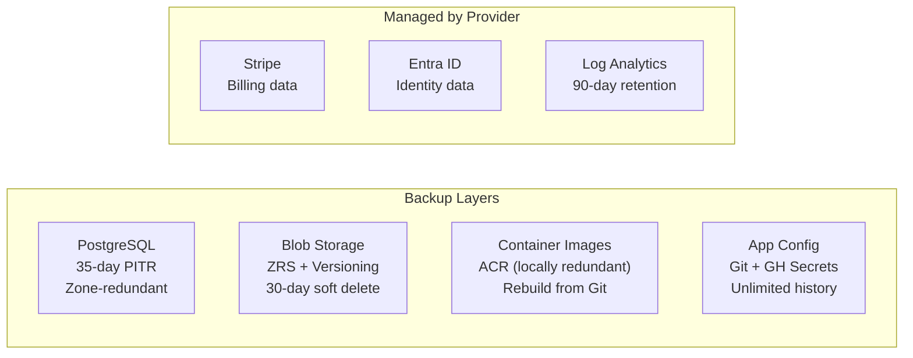
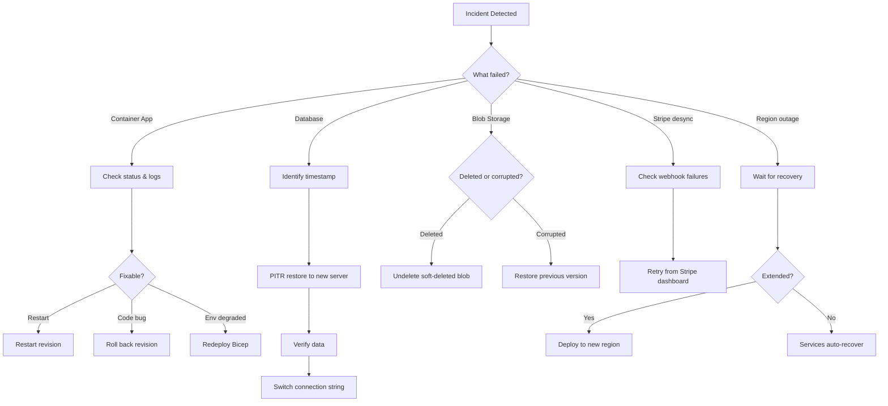

# Disaster Recovery & Backup

## Backup Summary

| Component          | Strategy                                  | Retention               | Redundancy           | RPO             | RTO                |
| ------------------ | ----------------------------------------- | ----------------------- | -------------------- | --------------- | ------------------ |
| PostgreSQL         | Azure automated PITR                      | 35 days                 | Zone-redundant       | Minutes         | < 1 hour           |
| Blob Storage       | Zone-redundant + versioning + soft delete | 30 days (deleted blobs) | Standard_ZRS (3 AZs) | 0 (synchronous) | Minutes            |
| Container Images   | Azure Container Registry                  | As stored               | Locally redundant    | 0               | Minutes (rebuild)  |
| Application Config | Git repository + GitHub Actions secrets   | Unlimited (git)         | GitHub redundancy    | 0               | Minutes (redeploy) |
| Stripe Data        | Managed by Stripe                         | Per Stripe policy       | Stripe-managed       | N/A             | N/A                |
| Entra ID           | Managed by Microsoft                      | Per Entra policy        | Microsoft-managed    | N/A             | N/A                |
| Logs               | Log Analytics workspace                   | 90 days                 | Azure-managed        | N/A             | N/A                |

**RPO** = Recovery Point Objective (maximum acceptable data loss).
**RTO** = Recovery Time Objective (maximum acceptable downtime).



## PostgreSQL Database

### Automated Backups

Azure Database for PostgreSQL Flexible Server provides automated backups:

- **Retention**: 35 days of point-in-time recovery (PITR)
- **Frequency**: Full backup weekly, differential daily, transaction log every 5 minutes
- **Redundancy**: Zone-redundant within the Azure region (data replicated across 3 availability zones)
- **Geo-redundancy**: Disabled (backups remain within the deployment region)
- **Encryption**: Backups are encrypted at rest using Azure-managed keys

### Restore to a Point in Time

Restore the database to any point within the 35-day retention window:

```bash
# Restore to a specific timestamp (UTC)
az postgres flexible-server restore \
  --resource-group {{RESOURCE_GROUP}} \
  --name {{PROJECT_NAME_LOWER}}-prod-postgres-restored \
  --source-server {{PROJECT_NAME_LOWER}}-prod-postgres \
  --restore-time "2026-03-25T10:30:00Z"
```

This creates a **new server** (`{{PROJECT_NAME_LOWER}}-prod-postgres-restored`). After verifying the restored data:

1. Update the `DATABASE_URL` secret in the Container Apps to point to the new server
2. Or use `pg_dump` / `pg_restore` to copy specific tables back to the original server

### Restore the Entire Server

```bash
# Full server restore (creates new server instance)
az postgres flexible-server restore \
  --resource-group {{RESOURCE_GROUP}} \
  --name {{PROJECT_NAME_LOWER}}-prod-postgres-restored \
  --source-server {{PROJECT_NAME_LOWER}}-prod-postgres \
  --restore-time "2026-03-25T10:30:00Z"

# After verification, update the connection string in Container Apps
az containerapp secret set \
  --name {{PROJECT_NAME_LOWER}}-prod-api \
  --resource-group {{RESOURCE_GROUP}} \
  --secrets database-url="postgresql://mojoupadmin:<password>@{{PROJECT_NAME_LOWER}}-prod-postgres-restored.postgres.database.azure.com:5432/mojoup_portal?sslmode=require"

# Restart the app to pick up the new secret
az containerapp revision restart \
  --name {{PROJECT_NAME_LOWER}}-prod-api \
  --resource-group {{RESOURCE_GROUP}} \
  --revision <active-revision>
```

### Manual Database Export

For additional safety or migration purposes:

```bash
# Export database to a local file
pg_dump "postgresql://mojoupadmin:<password>@{{PROJECT_NAME_LOWER}}-prod-postgres.postgres.database.azure.com:5432/mojoup_portal?sslmode=require" \
  --format=custom --file=backup_$(date +%Y%m%d_%H%M%S).dump

# Restore from export
pg_restore --dbname="<target-connection-string>" --clean --if-exists backup_20260325_103000.dump
```

> **Note**: To run `pg_dump` against the production server, you must add a temporary firewall rule for your IP, then remove it afterwards.

## Azure Blob Storage

### Protection Layers

The storage account (`{{PROJECT_NAME_LOWER}}-prod-storage`) has three layers of protection:

1. **Zone-Redundant Storage (ZRS)**: Data is synchronously replicated across 3 availability zones within the region. Protects against single-zone failures.
2. **Blob Versioning**: Every overwrite or modification creates a new version. Previous versions are retained and can be restored.
3. **Soft Delete**: Deleted blobs and containers are retained for 30 days before permanent removal.

### Recover a Deleted Blob

```bash
# List soft-deleted blobs
az storage blob list \
  --account-name {{STORAGE_ACCOUNT}} \
  --container-name downloads \
  --include d \
  --query "[?deleted]" \
  --output table

# Undelete a specific blob
az storage blob undelete \
  --account-name {{STORAGE_ACCOUNT}} \
  --container-name downloads \
  --name "<blob-path>"
```

### Restore a Previous Blob Version

```bash
# List versions of a blob
az storage blob list \
  --account-name {{STORAGE_ACCOUNT}} \
  --container-name downloads \
  --prefix "<blob-path>" \
  --include v \
  --output table

# Promote a previous version to current
az storage blob copy start \
  --account-name {{STORAGE_ACCOUNT}} \
  --destination-container downloads \
  --destination-blob "<blob-path>" \
  --source-uri "https://{{STORAGE_ACCOUNT}}.blob.core.windows.net/downloads/<blob-path>?versionid=<version-id>"
```

### Recover a Deleted Container

```bash
# List soft-deleted containers
az storage container list \
  --account-name {{STORAGE_ACCOUNT}} \
  --include-deleted \
  --query "[?deleted]" \
  --output table

# Restore a deleted container
az storage container restore \
  --account-name {{STORAGE_ACCOUNT}} \
  --name downloads \
  --deleted-version "<version>"
```

## Container Images

Container images are stored in Azure Container Registry (`{{ACR_NAME}}`) on the Basic tier (locally redundant).

### Recovery

If an image is accidentally deleted, rebuild and push from the Git commit:

```bash
# Check out the target commit
git checkout <commit-sha>

# Rebuild and push
az acr login --name {{ACR_NAME}}
docker build -f packages/api/Dockerfile -t {{ACR_NAME}}.azurecr.io/mojoup-api:<commit-sha> .
docker push {{ACR_NAME}}.azurecr.io/mojoup-api:<commit-sha>
```

## Application Configuration

### Infrastructure as Code

All Azure resources are defined in `infra/main.bicep`. Re-running the deployment recreates any missing or misconfigured resources:

```bash
az deployment group create \
  --resource-group {{RESOURCE_GROUP}} \
  --template-file infra/main.bicep \
  --parameters @infra/parameters.prod.json
```

### Secrets Recovery

Secrets are stored in GitHub Actions (repository secrets). If secrets are lost:

| Secret                                              | Recovery Method                                                                                                                                     |
| --------------------------------------------------- | --------------------------------------------------------------------------------------------------------------------------------------------------- |
| `DB_PASSWORD`                                       | Reset via Azure Portal or `az postgres flexible-server update`                                                                                      |
| `STRIPE_SECRET_KEY`                                 | Regenerate in Stripe Dashboard                                                                                                                      |
| `STRIPE_WEBHOOK_SECRET`                             | Recreate the webhook endpoint in Stripe                                                                                                             |
| `ACTIVATION_HMAC_KEY`                               | **Critical**: must use the original key or all existing activation codes become invalid. Ensure this is stored in a secure vault outside of GitHub. |
| `AZURE_CLIENT_ID` / `TENANT_ID` / `SUBSCRIPTION_ID` | Available from Azure Portal (Entra app registrations / subscription settings)                                                                       |

## Disaster Recovery Procedures



### Scenario 1: Container App Failure

**Symptoms**: Application returns 5xx errors or is unreachable.

1. Check Container App status: `az containerapp show --name {{PROJECT_NAME_LOWER}}-prod-api --resource-group {{RESOURCE_GROUP}}`
2. Check logs in Log Analytics (see queries in [Operations](operations.md#query-container-logs))
3. Restart the current revision: `az containerapp revision restart --name {{PROJECT_NAME_LOWER}}-prod-api --resource-group {{RESOURCE_GROUP}} --revision <revision>`
4. If the issue is in the code, roll back to a previous revision (see [Operations: Rolling Back](operations.md#rolling-back-a-deployment))
5. If the Container App Environment is degraded, redeploy infrastructure via Bicep

### Scenario 2: Database Corruption or Accidental Data Loss

**Symptoms**: Missing or incorrect data reported by users.

1. Identify the time just before the incident
2. Restore the database to a point in time (see [PostgreSQL: Restore to a Point in Time](#restore-to-a-point-in-time))
3. Verify the restored data on the new server
4. Either switch the application to the restored server or selectively export/import affected tables
5. Remove the temporary restored server after recovery is complete

### Scenario 3: Storage Account Data Loss

**Symptoms**: Download links fail, files missing.

1. Check if blobs are soft-deleted (see [Blob Storage: Recover a Deleted Blob](#recover-a-deleted-blob))
2. If overwritten, restore from a previous version (see [Restore a Previous Blob Version](#restore-a-previous-blob-version))
3. If the container itself was deleted, restore it within 30 days
4. If files were uploaded from a known source, re-upload to the `downloads` container

### Scenario 4: Stripe Webhook Desync

**Symptoms**: Subscription status in the database does not match Stripe.

1. Check Stripe Dashboard → Webhooks → Events for failed deliveries
2. Retry failed webhook events from the Stripe Dashboard
3. If many records are out of sync, write a one-off reconciliation script using the Stripe API to fetch current subscription states and update the database

### Scenario 5: Complete Region Failure

**Impact**: All services are unavailable. Data is intact (ZRS protects storage within-region; database backups are zone-redundant).

1. Wait for Azure to recover the region (most outages resolve within hours)
2. If extended outage, deploy to a different region:
   - Create a new resource group in the target region
   - Deploy `infra/main.bicep` to the new region
   - Restore the database from backup (if backups are accessible)
   - Re-upload blob data from source if needed
   - Update DNS records to point to the new Container Apps

> **Note**: Without geo-redundant backups, a full region loss (data centre destruction) could result in data loss. This is an accepted trade-off for cost. If regional disaster protection is required in future, enable `geoRedundantBackup` on the PostgreSQL server and switch storage to `Standard_GZRS`.

## Backup Verification

Periodically verify that backups are functional:

### Database Backup Verification (Recommended: Quarterly)

```bash
# 1. Restore database to a test server
az postgres flexible-server restore \
  --resource-group {{RESOURCE_GROUP}} \
  --name {{PROJECT_NAME_LOWER}}-backup-test \
  --source-server {{PROJECT_NAME_LOWER}}-prod-postgres \
  --restore-time "$(date -u -d '1 hour ago' +%Y-%m-%dT%H:%M:%SZ)"

# 2. Connect and verify data
psql "postgresql://mojoupadmin:<password>@{{ORG_SCOPE}}-backup-test.postgres.database.azure.com:5432/mojoup_portal?sslmode=require" \
  -c "SELECT count(*) FROM organisations; SELECT count(*) FROM subscriptions; SELECT count(*) FROM licences;"

# 3. Clean up test server
az postgres flexible-server delete \
  --resource-group {{RESOURCE_GROUP}} \
  --name {{PROJECT_NAME_LOWER}}-backup-test --yes
```

### Blob Storage Verification (Recommended: Quarterly)

```bash
# Verify versioning is enabled
az storage blob service-properties show \
  --account-name {{STORAGE_ACCOUNT}} \
  --query "isVersioningEnabled"

# Verify soft delete is enabled
az storage blob service-properties show \
  --account-name {{STORAGE_ACCOUNT}} \
  --query "deleteRetentionPolicy"

# Verify a sample blob can be downloaded
az storage blob download \
  --account-name {{STORAGE_ACCOUNT}} \
  --container-name downloads \
  --name "<known-blob-path>" \
  --file /tmp/verify-download
```

## Future Considerations

| Improvement                                             | Benefit                                   | Cost Impact              |
| ------------------------------------------------------- | ----------------------------------------- | ------------------------ |
| Enable `geoRedundantBackup` on PostgreSQL               | Cross-region database backup protection   | ~2x backup storage cost  |
| Switch storage to `Standard_GZRS`                       | Cross-region blob redundancy              | ~2x storage cost         |
| Enable High Availability (requires General Purpose SKU) | Automatic database failover within region | Significant (2x compute) |
| Automate backup verification in CI/CD                   | Regular, automated verification           | Minimal (compute time)   |
| Azure Backup vault for long-term retention              | Compliance and audit requirements         | Per-GB storage cost      |
