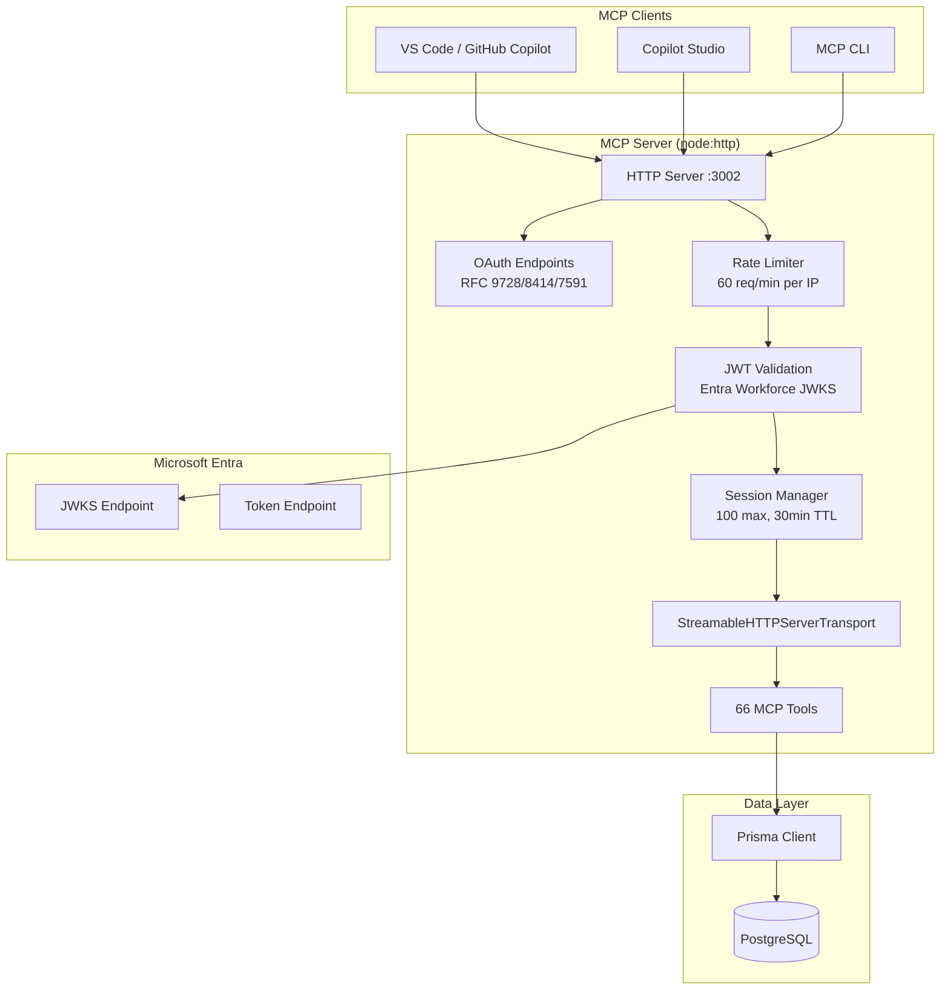
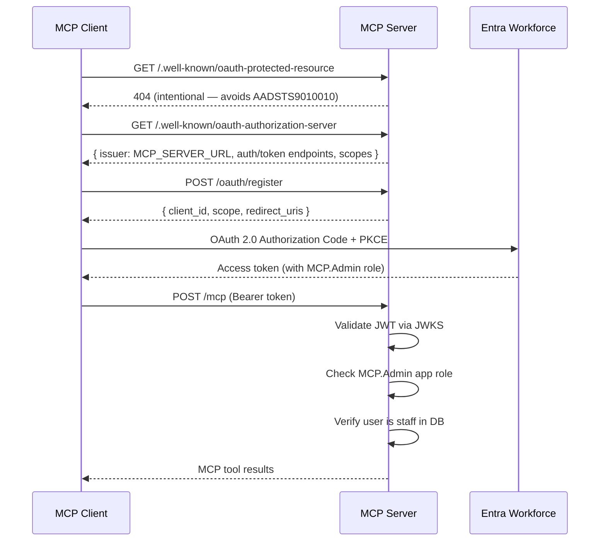

# MCP Server

## Overview

The MCP server (`packages/mcp-server`) provides 66 AI agent automation tools for {{PROJECT_NAME}} staff. It implements the Model Context Protocol over Streamable HTTP transport using raw `node:http` (not Express). Authentication uses Microsoft Entra Workforce (standard AAD) OAuth 2.0 with RFC-compliant metadata endpoints.

**URL**: `https://customerportalmcp.{{DOMAIN}}`

## Architecture



## Authentication

### Flow



> **Why PRM returns 404:** When PRM exists, the MCP SDK sends an RFC 8707 `resource` parameter to Entra. Entra v2.0 rejects requests with both `resource` and scopes (`AADSTS9010010`). Returning 404 makes the SDK skip `resource` and rely on authorization server metadata / DCR instead.

### Requirements

| Check | Details |
|-------|---------|
| Token type | Bearer JWT from Entra Workforce tenant |
| Issuer | `login.microsoftonline.com/{tenantId}/v2.0` or `sts.windows.net/{tenantId}/` |
| Audience | `api://{clientId}` or bare `{clientId}` |
| Algorithm | RS256 |
| App role | `MCP.Admin` (configured in Entra app registration) |
| Database check | User must exist with `isStaff = true` |
| JWKS caching | 5 entries, 10-minute TTL |

## OAuth Metadata Endpoints

| Endpoint | RFC | Method | Purpose |
|----------|-----|--------|--------|
| `/.well-known/oauth-protected-resource` | 9728 | GET | Returns **404** (intentional — avoids AADSTS9010010) |
| `/.well-known/oauth-authorization-server` | 8414 | GET | Returns Entra endpoints, scopes, and `issuer: MCP_SERVER_URL` |
| `/oauth/register` | 7591 | POST | Dynamic client registration — returns pre-registered Entra client ID + scopes |

## Session & Rate Limiting

| Setting | Value |
|---------|-------|
| Max concurrent sessions | 100 |
| Session TTL | 30 minutes (inactivity) |
| Max body size | 1 MB |
| Rate limit | 60 requests/minute per IP |
| HTTP timeout | 0 (disabled — SSE streams are long-lived) |
| Header timeout | 10 seconds |

## Tools (66 total)

### Organisation Tools (7)

| Tool | Description | Parameters |
|------|-------------|------------|
| `list_organisations` | List orgs with optional search | `search?`, `limit?` (default 10) |
| `get_organisation_detail` | Full org detail (members, subs, licences, envs) | `identifier` (UUID, CUST-ID, or name) |
| `create_organisation` | Create a new organisation | `name`, `ownerUserId?` |
| `update_organisation` | Update organisation details | `orgId`, `name` |
| `delete_organisation` | Delete an organisation | `orgId` |
| `invite_member` | Invite a user to an organisation | `orgId`, `email`, `role` |
| `add_member` | Directly add a user to an organisation | `orgId`, `userId`, `role` |
| `change_member_role` | Change a member's role | `orgId`, `userId`, `role` |
| `remove_member` | Remove a member from an organisation | `orgId`, `userId` |

### Subscription Tools (2)

| Tool | Description | Parameters |
|------|-------------|------------|
| `list_subscriptions` | List subscriptions with filters | `status?`, `expiringWithinDays?`, `limit?` (default 20) |
| `extend_subscription` | Extend subscription end date | `subscriptionId`, `newEndDate` (ISO) |

### Licence Tools (3)

| Tool | Description | Parameters |
|------|-------------|------------|
| `generate_activation_code` | Generate HMAC-signed activation code | `environmentCode`, `licenceType`, `subscriptionId?`, `endDate?`, `days?` |
| `create_licence` | Create licence for an org | `orgId`, `productId`, `type`, `subscriptionId?`, `expiryDate?`, `maxEnvironments?` |
| `approve_environment_increase` | Increase max environments | `licenceId`, `newLimit` (1-50) |

### Support Tools (7)

| Tool | Description | Parameters |
|------|-------------|------------|
| `list_support_tickets` | List tickets with filters | `status?`, `limit?` (default 20) |
| `get_ticket_detail` | Full ticket with all messages | `ticketId` |
| `reply_to_ticket` | Reply with visible or internal note | `ticketId`, `body`, `staffUserId`, `isInternal?` |
| `update_ticket_status` | Update status, priority, assignee, sentiment | `ticketId`, `status?`, `priority?`, `assigneeId?`, `sentiment?`, `productId?` |
| `get_ticket_stats` | Ticket statistics (by status, priority) | — |
| `get_sla_stats` | SLA compliance statistics | — |
| `get_stale_tickets` | Tickets approaching SLA breach | — |

### Product Tools (9)

| Tool | Description | Parameters |
|------|-------------|------------|
| `list_products` | List products | `activeOnly?` (default true) |
| `get_product_dashboard` | Per-product stats | `productId` |
| `create_product` | Create a product | `name`, `description`, `iconUrl?`, `features?`, `activationStrategy?` |
| `update_product` | Update product details | `productId`, `name?`, `description?`, etc. |
| `create_pricing_plan` | Add pricing plan to product | `productId`, `name`, `stripePriceId`, `interval`, `price`, `currency` |
| `delete_pricing_plan` | Delete a pricing plan | `planId` |
| `list_product_versions` | List versions for a product | `productId` |
| `create_product_version` | Create a new version | `productId`, `version`, `releaseNotes?`, `downloadUrl?` |
| `update_product_version` | Update version details | `versionId`, ... |
| `set_latest_version` | Mark a version as latest | `versionId` |
| `delete_product_version` | Delete a version | `versionId` |

### Download Tools (3)

| Tool | Description | Parameters |
|------|-------------|------------|
| `list_downloads` | List download files | `productId?` |
| `create_download` | Create download record | `productId`, `name`, `description`, `category`, `version`, `blobPath`, `fileSize` |
| `update_download` | Update download | `downloadId`, ... |
| `delete_download` | Delete download | `downloadId` |

### Knowledge Base Tools (5)

| Tool | Description | Parameters |
|------|-------------|------------|
| `list_kb_articles` | List articles | `productId?`, `type?`, `publishedOnly?` |
| `create_kb_article` | Create article | `title`, `body`, `type`, `productId?`, `isPublished?` |
| `update_kb_article` | Update article (creates version) | `articleId`, `title?`, `body?`, `type?`, `changeNote?` |
| `list_kb_versions` | List article versions | `articleId` |
| `restore_kb_version` | Restore to previous version | `articleId`, `versionId` |
| `delete_kb_article` | Delete article | `articleId` |

### Team & SLA Tools (8)

| Tool | Description | Parameters |
|------|-------------|------------|
| `list_teams` | List support teams | — |
| `create_team` | Create support team | `name`, `description?`, `productId?`, `isDefault?` |
| `update_team` | Update team | `teamId`, `name?`, `description?` |
| `delete_team` | Delete team | `teamId` |
| `add_team_member` | Add member to team | `teamId`, `userId` |
| `toggle_team_escalation` | Toggle escalation role | `teamId`, `userId` |
| `remove_team_member` | Remove from team | `teamId`, `userId` |
| `list_sla_policies` | List SLA policies | — |
| `update_sla_policy` | Update SLA thresholds | `policyId`, `firstResponseMinutes?`, `resolutionMinutes?`, `staleWarningMinutes?` |

### User Tools (4)

| Tool | Description | Parameters |
|------|-------------|------------|
| `list_users` | Search users | `search?`, `staffOnly?`, `limit?` (default 20) |
| `toggle_staff` | Grant/revoke staff access | `userId`, `isStaff` |
| `update_user` | Update user details | `userId`, ... |
| `delete_user` | Delete user | `userId` |

### Customer Logo Tools (4)

| Tool | Description | Parameters |
|------|-------------|------------|
| `list_customer_logos` | List all logos | — |
| `create_customer_logo` | Create logo | `name`, `logoUrl`, `website?`, `sortOrder?` |
| `update_customer_logo` | Update logo | `logoId`, ... |
| `delete_customer_logo` | Delete logo | `logoId` |

### Testimonial Tools (3)

| Tool | Description | Parameters |
|------|-------------|------------|
| `list_testimonials` | List all testimonials | — |
| `update_testimonial` | Approve/reject testimonial | `testimonialId`, `status`, ... |
| `delete_testimonial` | Delete testimonial | `testimonialId` |

### Content & Analytics Tools (3)

| Tool | Description | Parameters |
|------|-------------|------------|
| `list_contacts` | List contact form submissions | — |
| `get_sentiment_stats` | Ticket sentiment statistics | — |
| `get_feedback_stats` | Content feedback statistics | — |

### Dashboard (1)

| Tool | Description | Parameters |
|------|-------------|------------|
| `get_stats` | System-wide statistics | — |

## Audit Logging

All mutating operations are logged to stdout as structured JSON:

```json
{
  "level": "audit",
  "ts": "2026-03-28T10:00:00.000Z",
  "tool": "extend_subscription",
  "params": {
    "subscriptionId": "SUB-A1B2C3D4",
    "newEndDate": "2027-06-30"
  }
}
```

Logs are captured by Container Apps and shipped to Log Analytics (90-day retention).

## Configuration

| Variable | Required | Description |
|----------|----------|-------------|
| `DATABASE_URL` | Yes | PostgreSQL connection string |
| `ACTIVATION_HMAC_KEY` | Yes | HMAC key for activation codes |
| `ENTRA_WORKFORCE_TENANT_ID` | Yes | Entra Workforce tenant GUID |
| `ENTRA_WORKFORCE_CLIENT_ID` | Yes | Entra Workforce app client ID |
| `MCP_SERVER_URL` | Yes | Public URL (for metadata endpoints) |
| `MCP_PORT` | No | Server port (default 3002) |

## Client Configuration

### VS Code / GitHub Copilot

Add to MCP settings (discovers OAuth automatically via `.well-known` endpoints):

```json
{
  "servers": {
    "{{PROJECT_NAME_LOWER}}": {
      "url": "https://customerportalmcp.{{DOMAIN}}/mcp"
    }
  }
}
```

OAuth flow: PRM 404 → falls back to auth server metadata → DCR → Entra PKCE → `http://127.0.0.1` callback.

### Copilot Studio

Create a custom connector with manual OAuth 2.0:

| Setting | Value |
|---------|-------|
| Authorization URL | `https://login.microsoftonline.com/{tenantId}/oauth2/v2.0/authorize` |
| Token URL | `https://login.microsoftonline.com/{tenantId}/oauth2/v2.0/token` |
| Client ID | `{{ENTRA_WORKFORCE_CLIENT_ID}}` |
| Scope | `{{ENTRA_WORKFORCE_CLIENT_ID}}/.default openid offline_access` |
| Enable PKCE | Yes |

Requires **"Allow public client flows"** enabled and connector redirect URI added to public client redirect URIs.

### Entra App Registration

| Setting | Value |
|---------|-------|
| Sign-in audience | Single tenant (`AzureADMyOrg`) |
| Application ID URI | `https://customerportalmcp.{{DOMAIN}}/mcp` |
| Allow public client flows | Yes |
| App role | `MCP.Admin` (User type) |
| Web redirect URI | `https://github.com/login/oauth/authorize` |
| Public client redirect URIs | `http://127.0.0.1`, Copilot Studio connector URI |
| Implicit grant | Access tokens + ID tokens enabled |
| API permissions | `User.Read` (Microsoft Graph, Delegated) |
| Exposed scope | `access` (User consent) |
