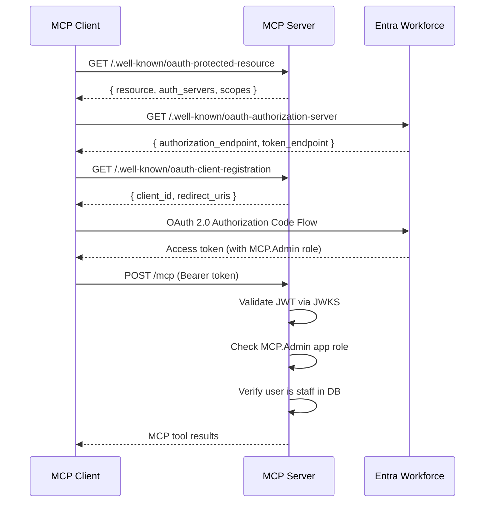
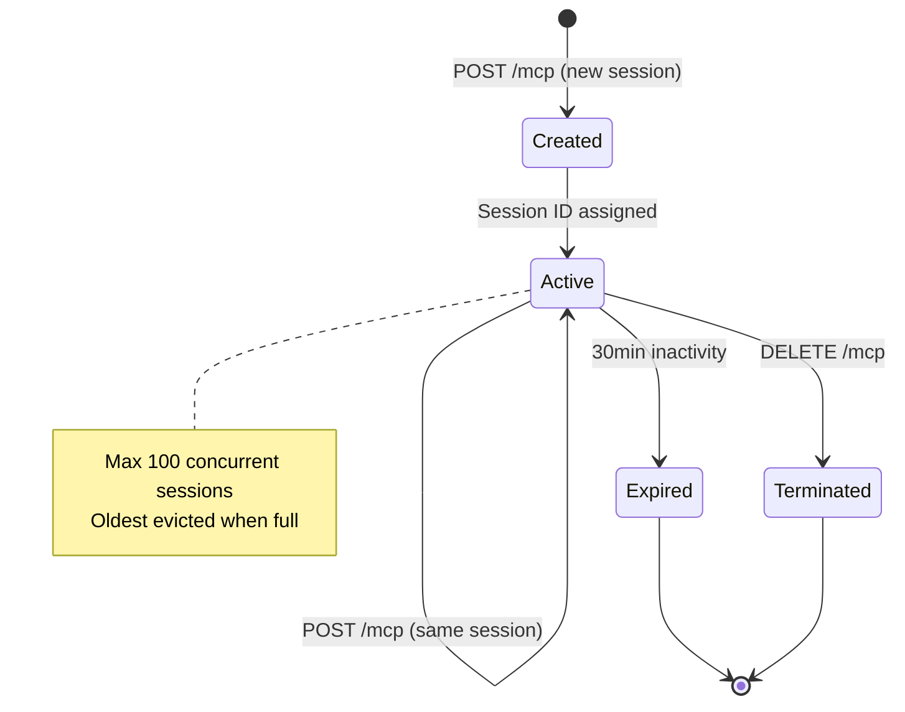
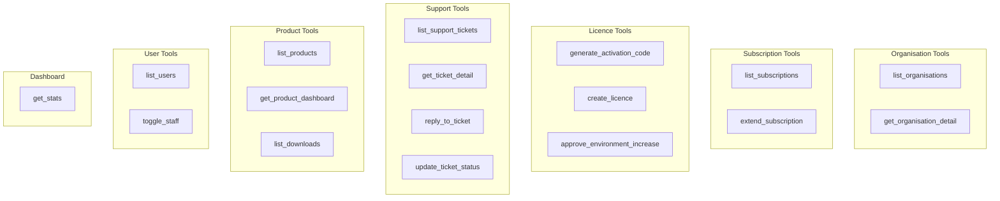

# MCP Server

## Overview

The MCP server (`packages/mcp-server`) provides AI agent automation tools for {{PROJECT_NAME}} staff. It implements the Model Context Protocol over Streamable HTTP transport using raw `node:http` (not Express). Authentication uses Microsoft Entra Workforce (standard AAD) OAuth 2.0 with RFC-compliant metadata endpoints.

**URL**: `https://customerportalmcp.{{DOMAIN}}`

## Architecture


## Authentication Flow



### Authentication Requirements

| Check | Details |
|-------|---------|
| Token type | Bearer JWT from Entra Workforce tenant |
| Issuer | `login.microsoftonline.com/{tenantId}/v2.0` or `sts.windows.net/{tenantId}/` |
| Audience | `api://{clientId}` or bare `{clientId}` |
| Algorithm | RS256 |
| App role | `MCP.Admin` (configured in Entra app registration) |
| Database check | User must exist with `isStaff = true` |
| JWKS caching | 5 entries, 10-minute TTL |

## OAuth Metadata Endpoints

These endpoints enable automatic client configuration per RFC standards.

### RFC 9728: Protected Resource Metadata

```
GET /.well-known/oauth-protected-resource
```

```json
{
  "resource": "https://customerportalmcp.{{DOMAIN}}",
  "authorization_servers": ["https://login.microsoftonline.com/{tenantId}/v2.0"],
  "scopes_supported": ["{clientId}/.default"],
  "bearer_methods_supported": ["header"]
}
```

### RFC 8414: Authorization Server Metadata

```
GET /.well-known/oauth-authorization-server
```

Proxies Entra's OpenID configuration with the server's scope.

### RFC 7591: Dynamic Client Registration

```
GET /.well-known/oauth-client-registration
POST /register
```

Returns the pre-registered Entra client ID (required for Copilot Studio which expects dynamic registration).

## Session Management



| Setting | Value |
|---------|-------|
| Max concurrent sessions | 100 |
| Session TTL | 30 minutes (inactivity) |
| Max body size | 1 MB |
| Rate limit | 60 requests/minute per IP |
| Request timeout | 30 seconds |
| Header timeout | 10 seconds |

## Tools

The MCP server exposes 17 tools for staff and AI agent automation.

### Tool Overview



### Organisation Tools

#### `list_organisations`

List all organisations with optional search.

| Parameter | Type | Required | Description |
|-----------|------|----------|-------------|
| `search` | string | No | Search by name or customer ID (e.g. `CUST-0001`) |
| `limit` | number | No | Max results (default 10) |

#### `get_organisation_detail`

Get full details including members, subscriptions, licences, and environments.

| Parameter | Type | Required | Description |
|-----------|------|----------|-------------|
| `identifier` | string | Yes | Organisation UUID, customer ID (`CUST-0001`), or exact name |

### Subscription Tools

#### `list_subscriptions`

List subscriptions with optional filters.

| Parameter | Type | Required | Description |
|-----------|------|----------|-------------|
| `status` | enum | No | `active`, `expired`, `cancelled`, `past_due` |
| `expiringWithinDays` | number | No | Active subscriptions expiring within N days |
| `limit` | number | No | Max results (default 20) |

#### `extend_subscription`

Extend a subscription end date and set status to active.

| Parameter | Type | Required | Description |
|-----------|------|----------|-------------|
| `subscriptionId` | string | Yes | Subscription ID (`SUB-xxxx`) |
| `newEndDate` | string | Yes | New end date (ISO format) |

### Licence Tools

#### `generate_activation_code`

Generate an HMAC-signed activation code for a product environment.

| Parameter | Type | Required | Description |
|-----------|------|----------|-------------|
| `environmentCode` | string | Yes | Environment code (e.g. `A7A8-551B-4BA1-42AB`) |
| `licenceType` | enum | Yes | `subscription`, `time_limited`, `unlimited` |
| `subscriptionId` | string | Conditional | Required for subscription type |
| `endDate` | string | Conditional | ISO date (required for subscription/time_limited unless `days` given) |
| `days` | number | Conditional | Days from now (alternative to `endDate`) |

#### `create_licence`

Create a new licence for an organisation.

| Parameter | Type | Required | Description |
|-----------|------|----------|-------------|
| `orgId` | string | Yes | Organisation UUID |
| `productId` | string | Yes | Product UUID |
| `type` | enum | Yes | `subscription`, `time_limited`, `unlimited` |
| `subscriptionId` | string | Conditional | For subscription type |
| `expiryDate` | string | Conditional | For time_limited type |
| `maxEnvironments` | number | No | Default 5 |

#### `approve_environment_increase`

Increase the maximum environment limit for a licence.

| Parameter | Type | Required | Description |
|-----------|------|----------|-------------|
| `licenceId` | string | Yes | Licence UUID |
| `newLimit` | number | Yes | New max environments (1–50) |

### Support Tools

#### `list_support_tickets`

| Parameter | Type | Required | Description |
|-----------|------|----------|-------------|
| `status` | enum | No | `open`, `in_progress`, `resolved`, `closed` |
| `limit` | number | No | Max results (default 20) |

#### `get_ticket_detail`

Get full ticket with all messages (including internal notes).

| Parameter | Type | Required | Description |
|-----------|------|----------|-------------|
| `ticketId` | string | Yes | Ticket UUID |

#### `reply_to_ticket`

Reply to a support ticket. Supports visible replies and internal staff notes.

| Parameter | Type | Required | Description |
|-----------|------|----------|-------------|
| `ticketId` | string | Yes | Ticket UUID |
| `body` | string | Yes | Message text |
| `staffUserId` | string | Yes | Staff user UUID |
| `isInternal` | boolean | No | Internal note (default false) |

#### `update_ticket_status`

| Parameter | Type | Required | Description |
|-----------|------|----------|-------------|
| `ticketId` | string | Yes | Ticket UUID |
| `status` | enum | No | `open`, `in_progress`, `resolved`, `closed` |
| `priority` | enum | No | `low`, `medium`, `high` |

### Product Tools

#### `list_products`

| Parameter | Type | Required | Description |
|-----------|------|----------|-------------|
| `activeOnly` | boolean | No | Only active products (default true) |

#### `get_product_dashboard`

Per-product stats: active/total subscriptions, licences, environments, open tickets, downloads (last 30 days).

| Parameter | Type | Required | Description |
|-----------|------|----------|-------------|
| `productId` | string | Yes | Product UUID |

#### `list_downloads`

| Parameter | Type | Required | Description |
|-----------|------|----------|-------------|
| `productId` | string | No | Filter by product |

### User Tools

#### `list_users`

| Parameter | Type | Required | Description |
|-----------|------|----------|-------------|
| `search` | string | No | Search by name or email |
| `staffOnly` | boolean | No | Only staff users |
| `limit` | number | No | Max results (default 20) |

#### `toggle_staff`

| Parameter | Type | Required | Description |
|-----------|------|----------|-------------|
| `userId` | string | Yes | User UUID |
| `isStaff` | boolean | Yes | Grant or revoke staff access |

### Dashboard

#### `get_stats`

No parameters. Returns system-wide statistics: organisations, users, active/total subscriptions, environments, open tickets.

## Audit Logging

All mutating operations are logged to stdout as structured JSON:

```json
{
  "level": "audit",
  "ts": "2026-03-28T10:00:00.000Z",
  "tool": "extend_subscription",
  "params": {
    "subscriptionId": "SUB-A1B2C3D4",
    "newEndDate": "2027-06-30",
    "previousEndDate": "2026-06-30T00:00:00.000Z"
  }
}
```

Audited operations: `auth`, `extend_subscription`, `update_ticket_status`, `approve_environment_increase`, `toggle_staff`, `create_licence`.

Logs are captured by Container Apps and shipped to Log Analytics (90-day retention).

## Configuration

| Variable | Required | Description |
|----------|----------|-------------|
| `DATABASE_URL` | Yes | PostgreSQL connection string |
| `ACTIVATION_HMAC_KEY` | Yes | HMAC key for activation codes |
| `ENTRA_WORKFORCE_TENANT_ID` | Yes | Entra Workforce tenant GUID |
| `ENTRA_WORKFORCE_CLIENT_ID` | Yes | Entra Workforce app client ID |
| `MCP_SERVER_URL` | Yes | Public URL (for metadata endpoints) |
| `MCP_PORT` | No | Server port (default 3002) |

## Client Configuration

### VS Code / GitHub Copilot

Add to your MCP settings:

```json
{
  "servers": {
    "{{PROJECT_NAME_LOWER}}": {
      "url": "https://customerportalmcp.{{DOMAIN}}/mcp",
      "headers": {
        "Authorization": "Bearer <token>"
      }
    }
  }
}
```

OAuth is handled automatically via the `.well-known` metadata endpoints.

### Copilot Studio

The server supports dynamic client registration (RFC 7591), returning the pre-registered Entra client ID. Copilot Studio requires **"Allow public client flows"** enabled in the Entra app registration.
