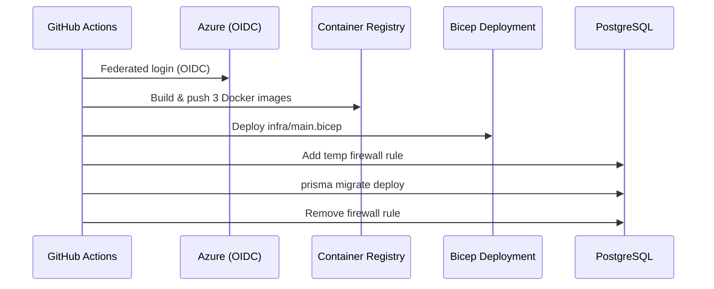
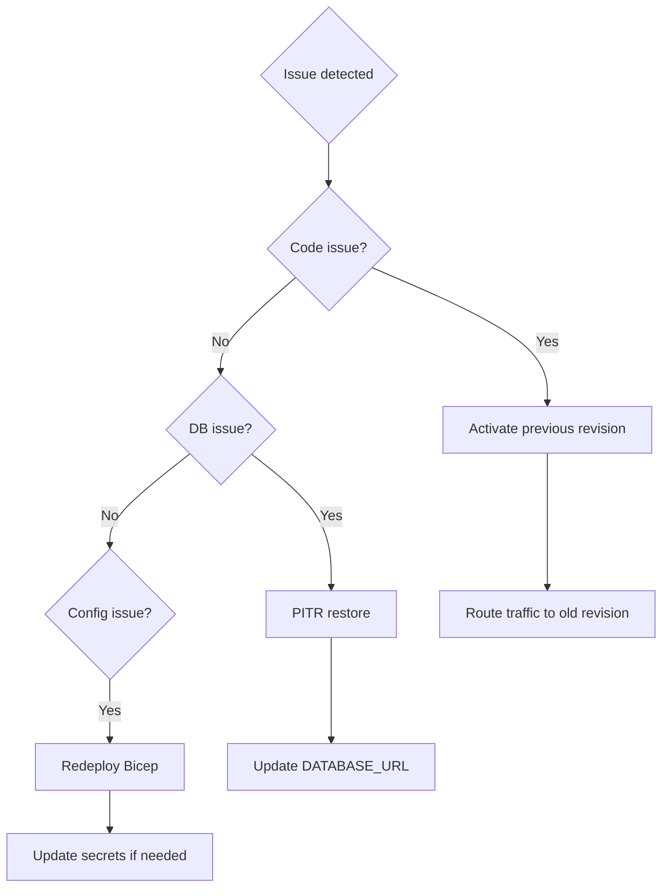

# Operations

## Deployment

### Prerequisites

- Azure CLI authenticated with a subscription containing the `{{RESOURCE_GROUP}}` resource group
- GitHub Actions secrets configured (see [Secrets](#github-actions-secrets) below)
- Custom domains (`api.{{DOMAIN}}`, `portal.{{DOMAIN}}`, `customerportalmcp.{{DOMAIN}}`) with DNS CNAME records pointing to the Container Apps Environment

### Production Deployment

Deployments are triggered manually via GitHub Actions:

```bash
gh workflow run deploy.yml --field environment=prod
```

Or from the GitHub Actions UI: **Actions → Deploy → Run workflow → prod**.

The pipeline:



1. Authenticates to Azure via federated identity (OIDC)
2. Builds three Docker images (API, Portal, MCP) tagged with the commit SHA
3. Pushes images to Azure Container Registry
4. Deploys infrastructure via Bicep (`infra/main.bicep`)
5. Runs Prisma database migrations (with temporary firewall rule for the runner IP)

### Manual Infrastructure Deployment

```bash
az deployment group create \
  --resource-group {{RESOURCE_GROUP}} \
  --template-file infra/main.bicep \
  --parameters \
    environment=prod \
    imageTag=<commit-sha> \
    entraExternalIdTenant=<tenant> \
    entraExternalIdTenantId=<tenant-id> \
    entraExternalIdClientId=<client-id> \
    entraWorkforceTenantId=<workforce-tenant-id> \
    entraWorkforceClientId=<workforce-client-id> \
    dbPassword=<password> \
    stripeSecretKey=<sk_live_...> \
    stripeWebhookSecret=<whsec_...> \
    activationHmacKey=<hmac-key>
```

### GitHub Actions Secrets

| Secret                        | Description                                             |
| ----------------------------- | ------------------------------------------------------- |
| `AZURE_CLIENT_ID`             | Service principal client ID (federated identity)        |
| `AZURE_TENANT_ID`             | Azure AD tenant ID                                      |
| `AZURE_SUBSCRIPTION_ID`       | Azure subscription ID                                   |
| `ENTRA_EXTERNAL_ID_TENANT`    | CIAM tenant subdomain                                   |
| `ENTRA_EXTERNAL_ID_TENANT_ID` | CIAM tenant GUID                                        |
| `ENTRA_EXTERNAL_ID_CLIENT_ID` | CIAM app registration client ID                         |
| `ENTRA_WORKFORCE_TENANT_ID`   | Workforce tenant GUID (MCP auth)                        |
| `ENTRA_WORKFORCE_CLIENT_ID`   | Workforce app registration client ID (MCP auth)         |
| `DB_PASSWORD`                 | PostgreSQL admin password                               |
| `DATABASE_URL`                | Full PostgreSQL connection string (used for migrations) |
| `STRIPE_SECRET_KEY`           | Stripe live secret key                                  |
| `STRIPE_WEBHOOK_SECRET`       | Stripe webhook signing secret                           |
| `ACTIVATION_HMAC_KEY`         | HMAC key for licence activation codes                   |
| `ACS_CONNECTION_STRING`       | Azure Communication Services connection string          |
| `ACS_SENDER_ADDRESS`          | Email sender address (e.g. `no-reply@{{ORG_SCOPE}}.com.au`)    |
| `CRON_SECRET`                 | Secret for cron job endpoints                           |

## Local Development

### Start Services

```bash
# Install dependencies
pnpm install

# Start PostgreSQL
docker compose up db -d

# Generate Prisma client + push schema
pnpm db:generate
pnpm db:push

# Start all services in watch mode
pnpm dev
```

### Local Endpoints

| Service       | URL                                                    |
| ------------- | ------------------------------------------------------ |
| Portal        | http://localhost:5173                                  |
| API           | http://localhost:3001                                  |
| MCP Server    | http://localhost:3002                                  |
| PostgreSQL    | localhost:5432 (user: `mojoppm`, password: `localdev`) |
| Prisma Studio | http://localhost:5555 (`pnpm db:studio`)               |

### Docker Compose (full stack)

```bash
docker compose up --build
```

This starts all four services (db, api, portal, mcp). The portal is served at `http://localhost:8080` in this mode.

## Database Operations

### Run Migrations

```bash
# Development: apply pending migrations
pnpm db:migrate

# Production: deploy migrations (no interactive prompts)
cd packages/api && npx prisma migrate deploy
```

### Create a Migration

```bash
cd packages/api
npx prisma migrate dev --name <migration_name>
```

### Reset Database (Development Only)

```bash
cd packages/api
npx prisma migrate reset
```

### Open Prisma Studio

```bash
pnpm db:studio
```

## Monitoring & Logging

### Log Analytics

All container logs are shipped to Azure Log Analytics (`{{PROJECT_NAME_LOWER}}-prod-logs` workspace) with 90-day retention.

#### Query Container Logs

```kusto
// API errors in the last 24 hours
ContainerAppConsoleLogs_CL
| where ContainerAppName_s == "{{PROJECT_NAME_LOWER}}-prod-api"
| where Log_s contains "error" or Log_s contains "Error"
| where TimeGenerated > ago(24h)
| order by TimeGenerated desc

// Stripe webhook events
ContainerAppConsoleLogs_CL
| where ContainerAppName_s == "{{PROJECT_NAME_LOWER}}-prod-api"
| where Log_s contains "stripe" or Log_s contains "webhook"
| where TimeGenerated > ago(7d)
| order by TimeGenerated desc

// MCP server requests
ContainerAppConsoleLogs_CL
| where ContainerAppName_s == "{{PROJECT_NAME_LOWER}}-prod-mcp"
| where TimeGenerated > ago(24h)
| order by TimeGenerated desc
```

### Container App Metrics

Monitor via the Azure Portal or CLI:

```bash
# View current replicas
az containerapp show \
  --name {{PROJECT_NAME_LOWER}}-prod-api \
  --resource-group {{RESOURCE_GROUP}} \
  --query "properties.runningStatus"

# View recent revisions
az containerapp revision list \
  --name {{PROJECT_NAME_LOWER}}-prod-api \
  --resource-group {{RESOURCE_GROUP}} \
  --output table
```

### Health Checks

| Endpoint                                                                       | Expected                 |
| ------------------------------------------------------------------------------ | ------------------------ |
| `https://api.{{DOMAIN}}/health`                                             | `200 OK`                 |
| `https://portal.{{DOMAIN}}`                                                 | `200 OK` (nginx)         |
| `https://customerportalmcp.{{DOMAIN}}/.well-known/oauth-protected-resource` | `200 OK` (JSON metadata) |

## Scaling

### Auto-scaling Rules

| Service | Trigger                     | Min | Max |
| ------- | --------------------------- | --- | --- |
| API     | 50 concurrent HTTP requests | 1   | 3   |
| Portal  | Static (always running)     | 1   | 2   |
| MCP     | 20 concurrent HTTP requests | 0   | 2   |

### Manual Scaling

```bash
# Scale API to fixed 2 replicas
az containerapp update \
  --name {{PROJECT_NAME_LOWER}}-prod-api \
  --resource-group {{RESOURCE_GROUP}} \
  --min-replicas 2 --max-replicas 2
```

## Stripe Operations

### Webhook Configuration

The Stripe webhook endpoint is `https://api.{{DOMAIN}}/api/webhooks/stripe`. The following events must be enabled in the Stripe Dashboard:

- `checkout.session.completed`
- `invoice.paid`
- `invoice.payment_failed`
- `customer.subscription.deleted`
- `customer.subscription.updated`

### Verifying Webhook Delivery

Check the Stripe Dashboard under **Developers → Webhooks → Events** for delivery status and retry history. Failed deliveries are retried by Stripe automatically for up to 72 hours.

## Container Registry

### List Images

```bash
az acr repository list --name {{ACR_NAME}} --output table
```

### View Tags for a Repository

```bash
az acr repository show-tags --name {{ACR_NAME}} --repository mojoup-api --output table
```

### Purge Old Images (keep last 10)

```bash
az acr run --cmd "acr purge --filter '{{PROJECT_NAME_LOWER}}-api:.*' --keep 10 --ago 30d --untagged" \
  --registry {{ACR_NAME}} /dev/null
```

## Rolling Back a Deployment



### Revert to a Previous Container Image

```bash
# List recent revisions
az containerapp revision list \
  --name {{PROJECT_NAME_LOWER}}-prod-api \
  --resource-group {{RESOURCE_GROUP}} \
  --output table

# Activate a previous revision
az containerapp revision activate \
  --name {{PROJECT_NAME_LOWER}}-prod-api \
  --resource-group {{RESOURCE_GROUP}} \
  --revision <revision-name>

# Route all traffic to the previous revision
az containerapp ingress traffic set \
  --name {{PROJECT_NAME_LOWER}}-prod-api \
  --resource-group {{RESOURCE_GROUP}} \
  --revision-weight <revision-name>=100
```

### Revert a Database Migration

Prisma does not support automatic rollback of applied migrations. To revert:

1. Write a new migration that undoes the previous changes
2. Test in a development environment first
3. Deploy via the normal pipeline

For emergencies, connect directly to the database and apply SQL manually, then mark the migration as rolled back in the `_prisma_migrations` table.
