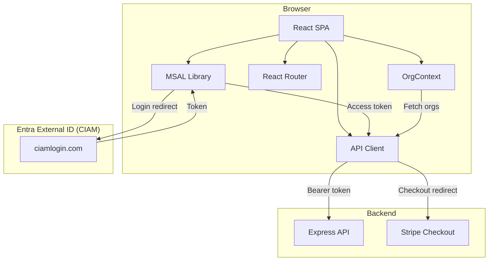
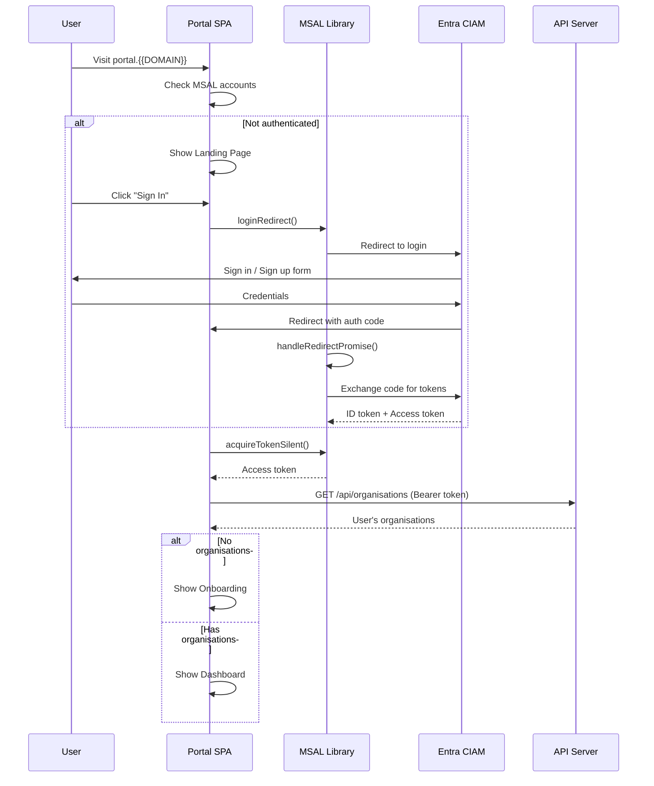
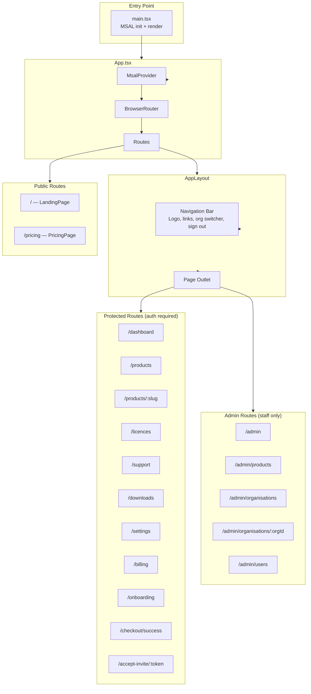
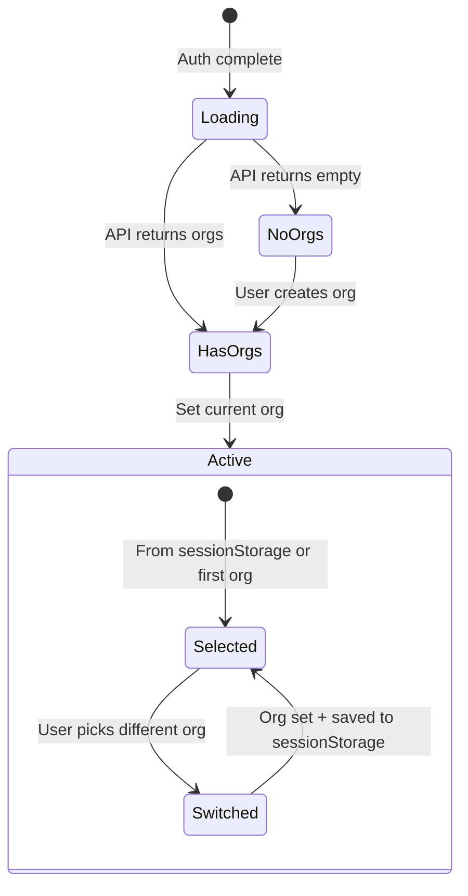
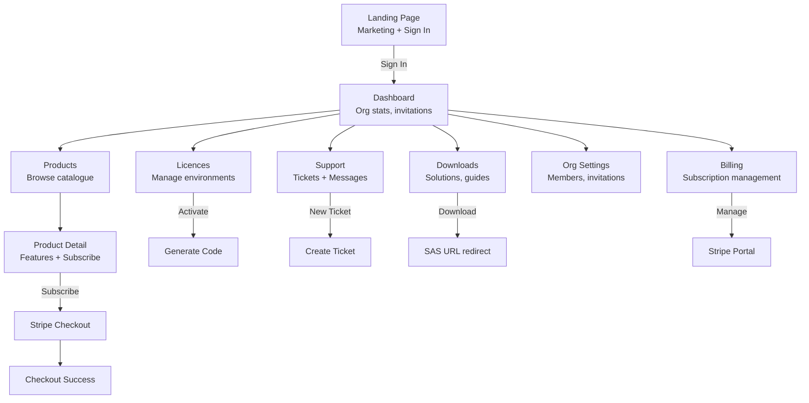
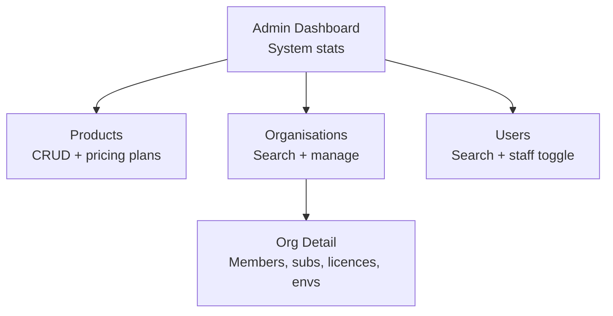

# Portal

## Overview

The portal (`packages/portal`) is a React single-page application built with Vite, TailwindCSS, and MSAL for authentication. It provides the customer-facing interface for managing organisations, subscriptions, licences, support tickets, and downloads, plus a staff admin panel.

**URL**: `https://portal.{{DOMAIN}}`

## Technology Stack

| Technology | Version | Purpose |
|-----------|---------|---------|
| React | 19 | UI framework |
| React Router | 7 | Client-side routing |
| Vite | 6 | Build tool and dev server |
| TailwindCSS | 4 | Utility-first CSS |
| MSAL Browser | 5 | Entra External ID authentication |
| MSAL React | 5 | React auth bindings |
| TypeScript | 5.8 | Type safety |
| nginx | Alpine | Production static hosting |

## Architecture



## Authentication Flow



## Application Structure



## Routing

### Public Routes (no authentication)

| Path | Page | Description |
|------|------|-------------|
| `/` | `LandingPage` | Marketing landing page with sign-in CTA |
| `/pricing` | `PricingPage` | Product pricing plans (fetched from API) |

### Protected Routes (authentication required)

All protected routes are wrapped in `<ProtectedRoute>`, which uses MSAL's `<AuthenticatedTemplate>` / `<UnauthenticatedTemplate>`. Unauthenticated users are redirected to `/`.

| Path | Page | Description |
|------|------|-------------|
| `/dashboard` | `DashboardPage` | Organisation overview, stats, pending invitations |
| `/products` | `ProductsPage` | Browse product catalogue |
| `/products/:slug` | `ProductDetailPage` | Product details with subscribe action |
| `/licences` | `LicencesPage` | Manage licences, environments, activation codes |
| `/support` | `SupportPage` | Support tickets — create, view, reply |
| `/downloads` | `DownloadsPage` | Download files (solutions, Power BI, guides) |
| `/settings` | `OrgSettingsPage` | Organisation settings, members, invitations |
| `/billing` | `BillingPage` | Subscription overview, Stripe portal link |
| `/onboarding` | `OnboardingPage` | Create first organisation (shown when user has no orgs) |
| `/checkout/success` | `CheckoutSuccessPage` | Post-checkout confirmation |
| `/accept-invite/:token` | `AcceptInvitePage` | Accept organisation invitation via link |

### Admin Routes (staff only)

Admin routes are visible only when the current user has `isStaff = true` (checked via `GET /api/me`).

| Path | Page | Description |
|------|------|-------------|
| `/admin` | `AdminDashboardPage` | System-wide statistics |
| `/admin/products` | `AdminProductsPage` | Manage products and pricing plans |
| `/admin/organisations` | `AdminOrganisationsPage` | Search and manage organisations |
| `/admin/organisations/:orgId` | `AdminOrgDetailPage` | Full org detail (members, subs, licences) |
| `/admin/users` | `AdminUsersPage` | User management, toggle staff access |

## Key Components

### `useAuth` Hook

Wraps MSAL operations and exposes:

| Property/Method | Type | Description |
|----------------|------|-------------|
| `isAuthenticated` | `boolean` | Whether a user account exists |
| `user` | `{ name, email } \| null` | Current user info from ID token claims |
| `account` | `AccountInfo` | Raw MSAL account |
| `getAccessToken()` | `Promise<string>` | Acquire token silently (refreshes automatically) |
| `login()` | `void` | Redirect to Entra CIAM login |
| `logout()` | `void` | Redirect logout |

**Email claim resolution order**: `emails[0]` → `email` → `preferred_username` → `username`

### `OrgContext` Provider

Manages the current organisation context across the app.



| Property/Method | Type | Description |
|----------------|------|-------------|
| `organisations` | `OrgInfo[]` | All organisations the user belongs to |
| `currentOrg` | `OrgInfo \| null` | Currently selected organisation |
| `setCurrentOrg(org)` | `void` | Switch org (persisted to `sessionStorage`) |
| `loading` | `boolean` | Whether orgs are being fetched |
| `refetch()` | `Promise<void>` | Re-fetch organisations from API |

### `useApi` Hook (API Client)

Provides an authenticated fetch wrapper that automatically attaches Bearer tokens.

```typescript
const { apiFetch } = useApi();

// GET request
const orgs = await apiFetch<OrgInfo[]>('/api/organisations');

// POST request
await apiFetch('/api/organisations', {
  method: 'POST',
  body: { name: 'New Org' },
});
```

Features:
- Automatic `Bearer` token via `getAccessToken()`
- JSON serialisation/deserialisation
- Error extraction from API response body
- `isSafeRedirectUrl()` helper for validating redirect URLs (HTTPS only, optional domain allowlist)

### `AppLayout`

The main layout for all authenticated pages:

- **Navigation bar**: Logo, page links, org switcher dropdown (when user has multiple orgs), email display, sign out
- **Admin link**: Visible only to staff users
- **Mobile responsive**: Hamburger menu for screens below `lg` breakpoint
- **Outlet**: Renders the matched child route

## Build & Deployment

### Development

```bash
# Start dev server with hot reload
cd packages/portal
pnpm dev
```

Vite dev server runs on `http://localhost:5173` with a proxy that forwards `/api` requests to `http://localhost:3001`.

### Production Build

```bash
pnpm --filter @{{ORG_SCOPE}}/portal build
```

Outputs static files to `packages/portal/dist/`.

### Docker Build

```mermaid
graph LR
    subgraph Stage1["Build Stage (node:24-slim)"]
        Install[pnpm install]
        BuildShared[Build @{{ORG_SCOPE}}/shared]
        BuildPortal[Build @{{ORG_SCOPE}}/portal<br/>with VITE_ build args]
    end

    subgraph Stage2["Production Stage (nginx:alpine)"]
        Copy[Copy dist/ to nginx html]
        Conf[Copy nginx.conf]
    end

    Stage1 --> Stage2
```

Build arguments injected at build time:

| Build Arg | Description |
|-----------|-------------|
| `VITE_API_URL` | API base URL (e.g. `https://api.{{DOMAIN}}`) |
| `VITE_ENTRA_EXTERNAL_ID_TENANT` | CIAM tenant subdomain |
| `VITE_ENTRA_EXTERNAL_ID_CLIENT_ID` | CIAM app client ID |

### nginx Configuration

Production static hosting with:

- **SPA fallback**: `try_files $uri $uri/ /index.html` — all routes fall through to React Router
- **Security headers**: X-Frame-Options, X-Content-Type-Options, Referrer-Policy, HSTS (2 years), Permissions-Policy
- **CSP**: Restricts scripts to `self`, allows connections to `*.{{DOMAIN}}`, `*.ciamlogin.com`, `*.stripe.com`, frames only from `*.ciamlogin.com`
- **Static asset caching**: 1 year with `immutable` for JS, CSS, images, fonts

## Configuration

Environment variables (injected at build time via Vite):

| Variable | Required | Description |
|----------|----------|-------------|
| `VITE_API_URL` | No | API base URL (dev proxy handles this locally) |
| `VITE_ENTRA_EXTERNAL_ID_TENANT` | Yes | CIAM tenant subdomain (e.g. `{{ENTRA_CIAM_TENANT}}`) |
| `VITE_ENTRA_EXTERNAL_ID_CLIENT_ID` | Yes | Entra app registration client ID |

### MSAL Configuration

| Setting | Value |
|---------|-------|
| Authority | `https://{tenant}.ciamlogin.com/` |
| Known authorities | `{tenant}.ciamlogin.com` |
| Redirect URI | `window.location.origin` |
| Cache location | `sessionStorage` |
| Login scopes | `api://{clientId}/access` |

## Page Summary

### Customer Pages



### Admin Pages


