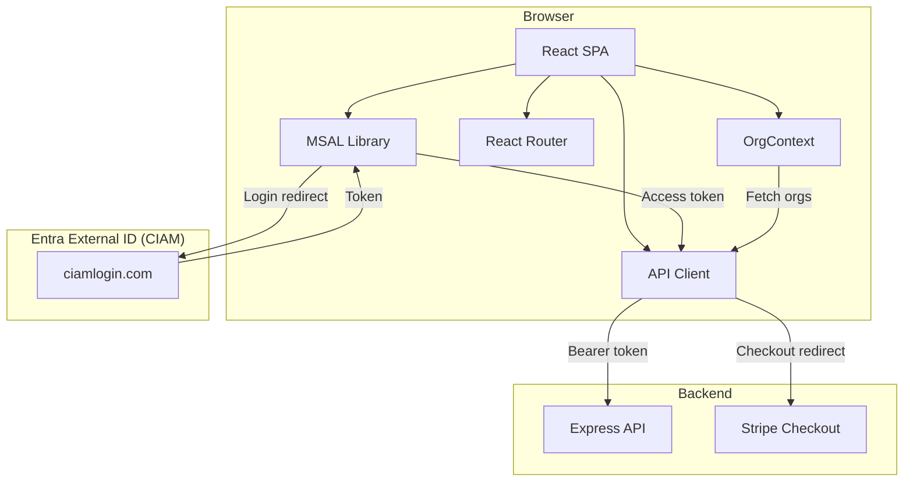

# Portal

## Overview

The portal (`packages/portal`) is a React single-page application built with Vite, TailwindCSS, and MSAL for authentication. It provides the customer-facing interface for managing organisations, subscriptions, licences, support tickets, knowledge base, downloads, and more, plus a comprehensive staff admin panel.

**URL**: `https://portal.{{DOMAIN}}`

## Technology Stack

| Technology | Version | Purpose |
|-----------|---------|---------|
| React | 19 | UI framework |
| React Router | 7 | Client-side routing |
| Vite | 6 | Build tool and dev server |
| TailwindCSS | 4 | Utility-first CSS |
| MSAL Browser | 5 | Entra External ID authentication |
| MSAL React | 5 | React auth bindings |
| TypeScript | 5.8 | Type safety |
| nginx | Alpine | Production static hosting |

## Architecture



## Routing

### Public Routes (4)

| Path | Page | Description |
|------|------|-------------|
| `/` | `LandingPage` | Marketing landing page with customer logos, testimonials, sign-in CTA |
| `/pricing` | `PricingPage` | Product pricing plans (fetched from API) |
| `/products` | `ProductsPage` | Browse product catalogue |
| `/products/:slug` | `ProductDetailPage` | Product details with features and subscribe action |

### Post-Login (1)

| Path | Page | Description |
|------|------|-------------|
| `/post-login` | `PostLoginRouter` | Redirect handler after auth (pending purchase or dashboard) |

### Authenticated Routes (13)

All protected routes are wrapped in `<ProtectedRoute>` using MSAL's `<AuthenticatedTemplate>`. Unauthenticated users are redirected to `/`.

| Path | Page | Description |
|------|------|-------------|
| `/dashboard` | `DashboardPage` | Organisation overview, stats, pending invitations, testimonial form |
| `/licences` | `LicencesPage` | Manage licences, environments, generate activation codes |
| `/support` | `SupportPage` | Create and list support tickets with file upload |
| `/support/:ticketId` | `TicketDetailPage` | Ticket messages, file attachments, KB suggestions (debounced search) |
| `/downloads` | `DownloadsPage` | Download files (solutions, Power BI, guides) with category filter |
| `/settings` | `OrgSettingsPage` | Organisation settings, members, invitations, delete org |
| `/billing` | `BillingPage` | Subscription overview, Stripe portal link |
| `/onboarding` | `OnboardingPage` | Create first organisation (shown when user has no orgs) |
| `/checkout/success` | `CheckoutSuccessPage` | Post-checkout confirmation, activate licence |
| `/profile` | `ProfilePage` | Edit user profile (name, job title, phone, mobile, marketing opt-out) |
| `/kb` | `KnowledgeBasePage` | Knowledge base search and browse |
| `/kb/:slug` | `ArticlePage` | Article detail with markdown rendering and table of contents |
| `/contact` | `ContactPage` | Contact form submission |
| `/accept-invite/:token` | `AcceptInvitePage` | Accept organisation invitation via link |

### Admin Routes (17, staff only)

Admin routes are visible only when the current user has `isStaff = true`. No frontend guard — backend enforces `requireStaff`.

| Path | Page | Description |
|------|------|-------------|
| `/admin` | `AdminDashboardPage` | System-wide statistics |
| `/admin/products` | `AdminProductsPage` | Manage products and pricing plans |
| `/admin/products/:productId/versions` | `AdminProductVersionsPage` | Manage product versions |
| `/admin/organisations` | `AdminOrganisationsPage` | Search and manage organisations |
| `/admin/organisations/:orgId` | `AdminOrgDetailPage` | Full org detail (members, subs, licences, envs) |
| `/admin/support` | `AdminSupportPage` | Support dashboard with stats |
| `/admin/support/tickets` | `AdminTicketsPage` | All tickets, filterable |
| `/admin/support/tickets/:ticketId` | `AdminTicketDetailPage` | Edit ticket, assign, add internal notes |
| `/admin/support/my-tickets` | `AdminMyTicketsPage` | Tickets assigned to current staff |
| `/admin/support/team-tickets` | `AdminTeamTicketsPage` | Team's tickets |
| `/admin/downloads` | `AdminDownloadsPage` | Upload and manage download files |
| `/admin/kb` | `AdminKBPage` | Create/edit knowledge base articles |
| `/admin/contacts` | `AdminContactsPage` | View contact form submissions |
| `/admin/customer-logos` | `AdminCustomerLogosPage` | Manage customer logo carousel |
| `/admin/testimonials` | `AdminTestimonialsPage` | Approve/reject testimonials |
| `/admin/sla-settings` | `AdminSLASettingsPage` | Configure SLA policies |
| `/admin/users` | `AdminUsersPage` | User management, toggle staff access |

## Key Components

### `useAuth` Hook

Wraps MSAL operations and exposes:

| Property/Method | Type | Description |
|----------------|------|-------------|
| `isAuthenticated` | `boolean` | Whether a user account exists |
| `user` | `{ name, email } \| null` | Current user info from ID token claims |
| `account` | `AccountInfo` | Raw MSAL account |
| `getAccessToken()` | `Promise<string>` | Acquire token silently (refreshes automatically) |
| `login()` | `void` | Redirect to Entra CIAM login |
| `logout()` | `void` | Redirect logout |

**Email claim resolution order**: `emails[0]` → `email` → `preferred_username` → `username`

### `OrgContext` Provider

Manages the current organisation context across the app.

| Property/Method | Type | Description |
|----------------|------|-------------|
| `organisations` | `OrgInfo[]` | All organisations the user belongs to |
| `currentOrg` | `OrgInfo \| null` | Currently selected organisation |
| `setCurrentOrg(org)` | `void` | Switch org (persisted to `sessionStorage`) |
| `loading` | `boolean` | Whether orgs are being fetched |
| `refetch()` | `Promise<void>` | Re-fetch organisations from API |

### `useApi` Hook (API Client)

Provides an authenticated fetch wrapper that automatically attaches Bearer tokens.

- Automatic `Bearer` token via `getAccessToken()`
- JSON serialisation/deserialisation
- Error extraction from API response body
- `isSafeRedirectUrl()` helper for validating redirect URLs (HTTPS only, optional domain allowlist)
- `FormData` support for file uploads

### `AppLayout`

The main layout for all authenticated pages:

- **Navigation bar**: Logo, page links, org switcher dropdown (when user has multiple orgs), email display, sign out
- **Admin link**: Visible only to staff users
- **Mobile responsive**: Hamburger menu for screens below `lg` breakpoint
- **Outlet**: Renders the matched child route

### Reusable Components

| Component | File | Description |
|-----------|------|-------------|
| `RichTextArea` | `components/RichTextArea.tsx` | Markdown editor with button toolbar and preview |
| `MarkdownRenderer` | `components/MarkdownRenderer.tsx` | Markdown to HTML renderer (GFM + raw HTML) |
| `TableOfContents` | `components/TableOfContents.tsx` | Auto-generated article TOC from headings |
| `TestimonialForm` | `components/TestimonialForm.tsx` | Submit testimonial form (quote, rating, category) |

## Styling

- **TailwindCSS 4** with {{PROJECT_NAME}} design tokens
- Brand primary: teal (`{{BRAND_PRIMARY}}`) — buttons, links, active states
- Brand accent: orange (`{{BRAND_ACCENT}}`) — highlights, CTAs, badges
- Consistent spacing: use Tailwind scale (p-4, gap-6, etc.), not arbitrary values
- Responsive: mobile-first breakpoints (sm → md → lg → xl)

## Build & Deployment

### Development

```bash
pnpm dev:portal  # port 5173
```

Vite dev server proxies `/api` requests to `http://localhost:3001`.

### Production Build

```bash
pnpm --filter @{{ORG_SCOPE}}/portal build
```

### Docker Build

Build arguments injected at build time:

| Build Arg | Description |
|-----------|-------------|
| `VITE_API_URL` | API base URL (e.g. `https://api.{{DOMAIN}}`) |
| `VITE_ENTRA_EXTERNAL_ID_TENANT` | CIAM tenant subdomain |
| `VITE_ENTRA_EXTERNAL_ID_CLIENT_ID` | CIAM app client ID |

### nginx Configuration

- **SPA fallback**: `try_files $uri $uri/ /index.html`
- **Security headers**: X-Frame-Options, X-Content-Type-Options, Referrer-Policy, HSTS (2y), Permissions-Policy
- **CSP**: Restricts scripts to `self`, allows connections to `*.{{DOMAIN}}`, `*.ciamlogin.com`, `*.stripe.com`
- **Static asset caching**: 1 year with `immutable` for JS, CSS, images, fonts
